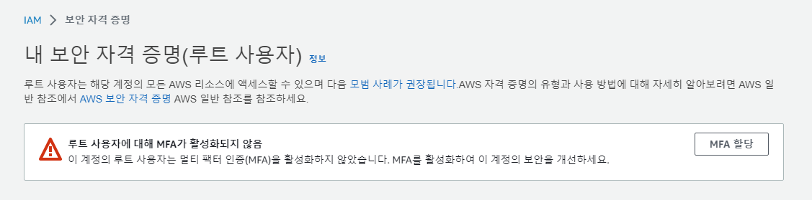

올해 서버가 필요한 일이 많아 마구잡이로 AWS 프리티어 계정을 생성하면서 나에게도 몇천만원이 결제되는 일이 생길까봐 걱정이 되기 시작했다..  
_“설마 그럴일이 있겠어~”_ 싶었지만 그게 바로 사망플래그라고 주변에서 경고해서 최소한의 보안을 위해 앞으로는 MFA, IAM을 설정해주려 한다.

MFA, IAM을 설정하는 방법을 설명하기에 앞서 MFA와 IAM은 당최 무엇인가?  
간단하게 말하자면 MFA(Multi-Facfor Authentication)는 로그인할 때 더 까다롭게 인증하는 것이고, IAM(Identity and Access Management)은 AWS의 모든 기능에 접근할 수 있는 루트 사용자 대신 특정 기능만 사용할 수 있도록 사용자를 생성하는 것이다.  
따라서 루트 사용자 계정에는 MFA를 적용해 접근하기 어렵게 만들고, 대신 IAM으로 권한을 줄인 사용자 계정을 만들어 사용하면 해당 사용자 계정이 털리더라도 몇천만원이 털리지는 않게 피해를 줄일 수 있다.

## 루트 사용자에 MFA 활성화

보안 자격 증명 서비스에 들어갔을 때 루트 사용자에 MFA 할당을 안했다면 알아서 하라고 경고가 뜬다.  
매우 친절하다. AWS에서도 내 계정이 털리지 않길 바라나 보다.



옆에 있는 MFA 할당 버튼을 누르거나 멀티 팩터 인증(MFA)를 직접 찾아서 활성화할 수도 있다.

방법은 매우 간단하다.  
모바일 디바이스 또는 컴퓨터 또는 기타 하드웨어 어쩌구를 이용해 인증하도록 설정해주면 된다.  
사용하기 쉽게 폰에 Authenticator 앱을 설치하고 QR코드를 통해 연결해준다.  
인증을 위해 MFA 숫자 두개를 입력하도록 하는데 앱의 MFA 숫자는 정해진 게 아니라 일정시간이 지나면 바뀌므로 바뀐 숫자를 추가로 입력해주면 된다.  
그러면 MFA 활성화 완료~


## IAM 사용자 설정

IAM 서비스에서 사용자를 추가한다.  
이름은 적당히 정하면 되고 권한 설정이 중요하다.  
여기서 머리가 좀 어지럽다. 권한이 너무 많아!  
그렇다고 Full Access 또는 관리자 수준의 권한을 주면 사용자를 만든 의미가 없어진다.


무려 1065개의 정책들…

나는 AWS 프리티어 계정에 인스턴스를 딱 하나만 만들고 접속해서 사용하는 것이 목표다.  
따라서 EC2 인스턴스 정보를 읽는 것과 해당 인스턴스에 연결하는 것만 가능하고 나머지는 다 제어하는 권한을 부여해야 한다.  
직접 권한을 부여하는 방법도 있지만 난 이미 존재하는 정책을 적용해 사용자 그룹을 만들었다.

1. AmazonEC2ReadOnlyAccess
2. EC2InstanceConnect

방금 만든 사용자 그룹에 해당하는 사용자를 생성한다.

여기서 끝이 아니다.  
콘솔로 접속할 수 있도록 콘솔 엑세스를 활성화해줘야 한다.  
사용자의 보안 자격 증명 탭에서 콘솔 액세스를 활성화할 수 있다.


이제 계정ID를 기억해두거나 콘솔 로그인 링크로 접속해 이 사용자로 콘솔 접속이 가능하다!  
계정 ID나 콘솔 로그인 링크, 사용자 이름, 사용자 암호를 꼭 기억해두자.

```toc

```
