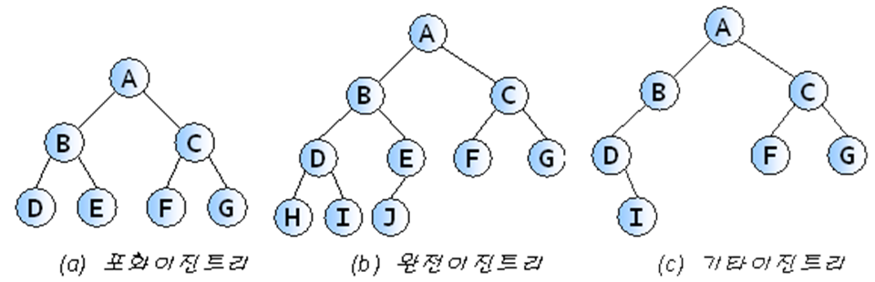
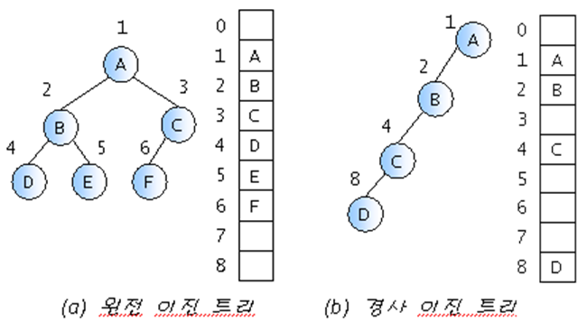
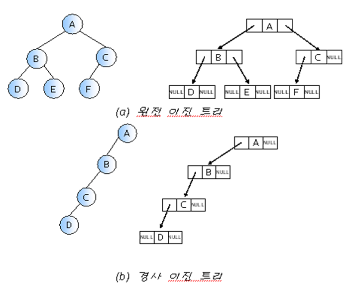

## 트리(Tree)란?

- 계층적인 구조를 나타내며, 부모-자식 관계의 노드들로 이루어짐
- 리스트, 스택, 큐와 같은 선형 자료구조가 아닌 비선형 자료구조

컴퓨터 디스크의 디렉터리 구조도 트리에 해당한다.

## 트리 용어

- node: 트리의 구성요소
- root: 부모가 없는 노드
- subtree: 하나의 노드와 그 노드의 자손들로 이루어진 트리
- terminal node(단말노드): 자식이 없는 노드
- non-terminal node(비단말노드): 적어도 하나의 자식을 가지는 노드
- level: 트리의 각 층의 번호
- 트리의 height(높이): 트리의 최대 레벨
- 노드의 degree(차수): 노드가 가지고 있는 자식 노드의 개수
- edge(간선): 노드와 노드를 연결하는 선
- 트리의 degree(차수): 트리가 가지고 있는 노드의 차수 중에서 가장 큰 차수
- forest: 트리들의 집합

## 이진트리(Binary tree)란?

- 자식 노드의 개수가 최대 2개인 트리 자료구조

서브트리 간에 순서가 존재하여 왼쪽과 오른쪽 서브트리를 구별한다.  
모든 노드의 차수가 2 이하이므로 구현하기 편리하다.

### 포화이진트리 full binary tree

- 트리의 각 레벨에 노드가 꽉 차있는 이진트리
- 정확하게 `2^k − 1`개의 노드를 가짐

### 완전이진트리 complete binary tree

- 마지막 레벨 전까지 모든 노드가 채워져 있고,  
  마지막 레벨은 왼쪽부터 오른쪽까지 노드가 순서대로 채워져 있는 이진트리



## 이진트리 표현법

이진트리 표현법에는 배열 표현법과 링크 표현법이 있다.

### 배열 표현법

모든 이진트리를 포화이진트리라고 가정하고 각 노드에 번호를 붙여서 그 번호를 배열의 인덱스로 삼아 노드의 데이터를 배열에 저장하는 방법이다.  
완전이진트리가 아닌 일반적인 이진트리의 경우 메모리 낭비가 심해진다.



### 링크 표현법

포인터를 이용하여 부모노드가 자식노드를 가리키게 하는 방법이다.



## 이진트리 순회

> traversal 순회  
> 트리의 모든 노드들을 체계적으로 방문하는 것

전위 순회, 중위 순회, 후위 순회의 3가지 기본적인 순회 방법이 있다.

### 전위 순회 preorder traversal

- 루트노드 → 왼쪽 자손노드 → 오른쪽 자손노드 순으로 방문 (VLR)
- 예시: 구조화된 문서출력

다음은 전위 순회 알고리즘의 pseudocode이다.

```c
preorder(x)
  if x!=null
    then print x->data; // 노드 방문
      preorder(x->left); // 왼쪽 서브트리 순회
      preorder(x->right); // 오른쪽 서브트리 순회
```

### 중위 순회 inorder traversal

- 왼쪽 자손노드 → 루트 → 오른쪽 자손노드 순으로 방문 (LVR)
- 예시: 산술식 표현

다음은 중위 순회 알고리즘의 pseudocode이다.

```c
inorder(x)
  if x!=null
    then inorder(x->left); // 왼쪽 서브트리 순회
      print x->data; // 노드 방문
      inorder(x->right); // 오른쪽 서브트리 순회
```

### 후위 순회 postorder traversal

- 왼쪽 자손노드 → 오른쪽 자손노드 → 루트 순으로 방문 (LRV)
- 예시: 디렉토리 용량 계산 (하위 디렉토리 용량이 계산되어야 현재 디렉토리 용량 계산 가능)

다음은 후위 순회 알고리즘의 pseudocode이다.

```c
postorder(x)
  if x!=null
    then postorder(x->left); // 왼쪽 서브트리 순회
      postorder(x->right); // 오른쪽 서브트리 순회
      print x->data; // 노드 방문
```

```toc

```
