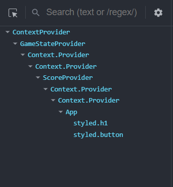

React에서 props drilling을 피하고 싶거나 변수를 전역적으로 사용하고 싶을 때 상태 관리 라이브러리를 사용하곤 한다.  
React는 상태 관리가 가장 중요한 만큼 관련된 다양한 라이브러리들이 있다.  
가장 대중적인 React Redux 부터 Recoil, Justand, Jotai, MobX 등등.

하지만 라이브러리를 사용하기 전에 React 자체 기능을 사용할 줄 알아야 한다고 생각한다.  
라이브러리도 React 기능을 사용해서 만들어졌기 때문이다.  
그래서 React 자체 기능인 Context API를 사용해 전역적으로 변수를 사용하는 방법을 정리했다.

## Context API 란?

Context는 props로 전달하지 않고도 컴포넌트 트리 전체에 정보를 공유할 수 있는 수단이다.

props로 전달하지 않는다는 것은 props drilling을 피할 수 있는 장점인 동시에 상태가 숨겨져 코드를 직관적으로 알아보기 힘들다는 단점을 의미한다.  
props를 넘겨주는 것은 단순히 번거로운 작업이 아니라 명시적으로 어떤 props가 넘어갔는지를 알려주는 작업이다.

따라서 Context를 남용하지 않는 것이 좋다.  
만약 컴포넌트에 직접적이지 않은 요소는 Context를 사용하는 대신 children으로 처리해 props 수를 줄일 수 있다.

### Context 만들기

`createContext`로 Context를 만들 수 있다.  
`createContext`의 인자로 default 값을 넘겨주면 Context가 `Provider`로 감싸져 있지 않을 때 사용된다.

```jsx
import { createContext } from 'react';

export const ThemeContext = createContext('light');
```

### Context 제공하기

`Provider`로 컴포넌트들을 감싸면, `Provider` 하위의 모든 컴포넌트에서 `Provider`의 `value`에 할당된 값에 접근할 수 있다.  
`Provider`를 사용하지 않으면 Context에서 default 값을 사용한다.

```jsx
import { useState } from 'react';
import { ThemeContext } from 'src/context/ThemeContext';

export default function App() {
  const [theme, setTheme] = useState('light');

  return (
    <ThemeContext.Provider value={theme}>
      <TodoInput />
      <TodoList />
    </ThemeContext.Provider>
  );
}
```

### Context 사용하기

`Provider` 하위의 컴포넌트에서 `useContext` 훅을 통해 Context를 가져올 수 있다.

```jsx
import { useContext } from 'react';
import { ThemeContext } from 'src/context/ThemeContext';

export default function TodoInput() {
  const theme = useContext(ThemeContext);

  // …
}
```

### Context는 상태를 변경할 수 없다.

위처럼 사용해보면 props로 받지 않고 useContext를 통해 상태를 받을 수 있다.  
그런데 상태를 변경하는 함수도 전역적으로 사용하고 싶다면 어떻게 해야 할까?  
Context는 단지 값을 props 없이 전달해줄 뿐 값을 변경해주진 않는다.  
그래서 상태를 변경하는 함수도 똑같은 과정을 거쳐 Context로 전달해야 한다.

## useReducer와 Context API 적용하기

Context와 useReduer를 사용해서 변수를 전역적으로 사용했다.  
useState로 state, setState를 만들어 둘 다 전역적으로 공유해도 되지만 useReducer를 사용하는 것이 상태 변경과 관련된 로직이 한 곳에 모여 보기 좋았다.

참고로 TypeScript로 작성했다.

### Context 만들기

useReducer를 사용할 것이기 때문에 먼저 reducer를 만든다.  
어떤 action일 때 어떤 상태 변화가 생기는 지 작성한다.

```tsx
function gameStateReducer(gameState: GameState, action: Action) {
  switch (action.type) {
    case 'READY': {
      return 'ready';
    }
    case 'START': {
      return 'playing';
    }
    case 'END': {
      return 'over';
    }
  }
}
```

Provider에서 useReducer로 상태와 dispatch 함수를 만들고 각각을 Context로 넘겨준다.  
Context가 두 개이기 때문에 Provider를 중첩해서 사용한다.

```tsx
type GameState = 'ready' | 'playing' | 'over';
type Action = { type: 'READY' | 'START' | 'END' };
type GameStateDispatch = Dispatch<Action>;

const GameStateContext = createContext<GameState | null>(null);
const GameStateDispatchContext = createContext<GameStateDispatch | null>(null);

type GameStateProviderProps = {
  children: React.ReactNode;
};

export function GameStateProvider({ children }: GameStateProviderProps) {
  const [gameState, dispatch] = useReducer(gameStateReducer, 'ready');

  return (
    <GameStateContext.Provider value={gameState}>
      <GameStateDispatchContext.Provider value={dispatch}>
        {children}
      </GameStateDispatchContext.Provider>
    </GameStateContext.Provider>
  );
}
```

Context가 필요할 때마다 useContext 훅과 필요한 Context를 import할 필요가 없도록 use상태 훅을 만들었다.  
use상태 훅을 통해 Context가 초기값일 경우 Error를 발생시켰다.

```tsx
export function useGameState() {
  const gameState = useContext(GameStateContext);
  if (gameState === null) throw new Error('Game state context is null.');
  return gameState;
}

export function useGameStateDispatch() {
  const gameStateDispatch = useContext(GameStateDispatchContext);
  if (gameStateDispatch === null) throw new Error('Game state dispatch context is null.');
  return gameStateDispatch;
}
```

### Context 제공하기

위에서 state Context와 dispatch Context의 Provider들을 묶어 한 Provider로 만들어 export했다.  
하지만 단지 하나의 상태에 대한 Context이고 또 다른 Context도 존재하기 때문에 `ContextProvider` 컴포넌트를 만들어 Provider들을 하나로 묶어줬다.

```tsx
import { GameStateProvider } from 'src/contexts/GameStateContext';
import { ScoreProvider } from 'src/contexts/ScoreContext';

type ContextProviderProps = {
  children: React.ReactNode;
};

export default function ContextProvider({ children }: ContextProviderProps) {
  return (
    <GameStateProvider>
      <ScoreProvider>{children}</ScoreProvider>
    </GameStateProvider>
  );
}
```

그리고 모든 컴포넌트에서 Context들을 사용할 수 있도록 가장 상위 컴포넌트에 배치했다.

```tsx
import ContextProvider from 'src/components/ContextProvider';

ReactDOM.createRoot(document.getElementById('root')!).render(
  <React.StrictMode>
    <ContextProvider>
      <App />
    </ContextProvider>
  </React.StrictMode>,
);
```

### Context 사용하기

만들었던 use상태 훅들을 import해서 상태를 사용하거나 변경했다.

```tsx
import { useGameState, useGameStateDispatch } from 'src/contexts/GameStateContext';
import Game from 'src/components/Game';
import GameResult from 'src/components/GameResult';

export default function App() {
  const gameState = useGameState();
  const gameStateDispatch = useGameStateDispatch();

  const startGame = () => {
    gameStateDispatch({ type: 'START' });
  };

  return (
    <>
      <Title>고양이 정말 좋아하세요?</Title>
      <StartButton onClick={startGame} disabled={gameState !== 'ready'}>
        증명하기
      </StartButton>
      {gameState === 'playing' && <Game />}
      {gameState === 'over' && <GameResult />}
    </>
  );
}
```

## 결론

이렇게 라이브러리 없이도 충분히 상태를 전역적으로 사용할 수 있다.  
Context 값에 변화가 있을 때만 Context 값을 사용한 컴포넌트가 리렌더링되기 때문에 Context 사용으로 인한 추가적인 리렌더링 문제도 없었다.  
(Context 값으로 객체를 사용하지 않아 그로 인한 리렌더링 문제도 없었다.)

하지만 Context를 추가할 때마다 Provider를 중첩해줘야 한다는 점은 참 불편했다.  
Provider 배열을 받아 하나의 Provier로 만들어주도록 만들 수는 있지만 여러 Provider들이 중첩되었다는 본질은 바뀌지 않는다.



보기만 해도 어지럽다. 😂

따라서 Context는 정말 필요할 때만 사용하는 것이 좋겠다.  
테마같은 상태를 전역적으로 사용하고 싶지만 상태 라이브러리까지는 사용하고 싶지 않을 때 사용하면 좋을 것 같다.

그리고 Context는 props 없이 값을 전달할 수 있는 기술일 뿐, 전역적으로 변수를 사용하기만을 위한 기술이 아니라는 것을 잊지 말자.  
또한 상태를 변경하기 위해 useReducer를 같이 사용했을 뿐 useState나 useReducer 없이도 사용할 수 있는 기술이다.

---

참고

- [React - Scaling Up with Reducer and Context](https://react.dev/learn/scaling-up-with-reducer-and-context)
- [React TypeScript Cheatsheet - Context](https://react-typescript-cheatsheet.netlify.app/docs/basic/getting-started/context/)
- [TypeScript 와 Context API 활용하기](https://react.vlpt.us/using-typescript/04-ts-context.html)

```toc

```
