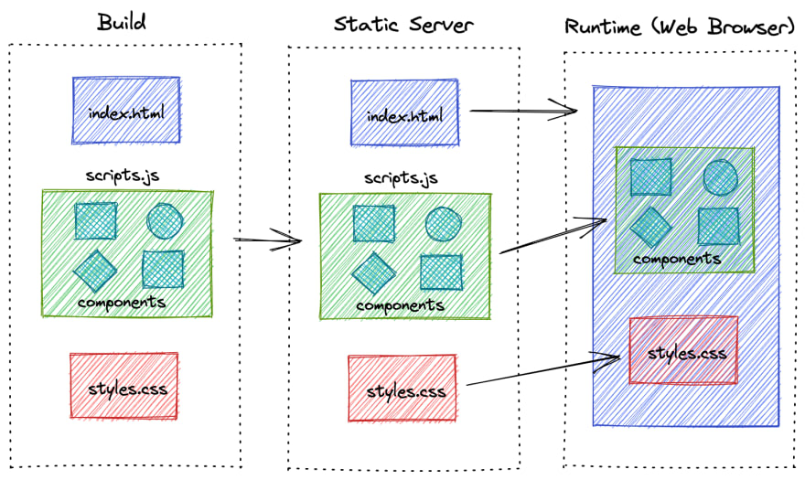
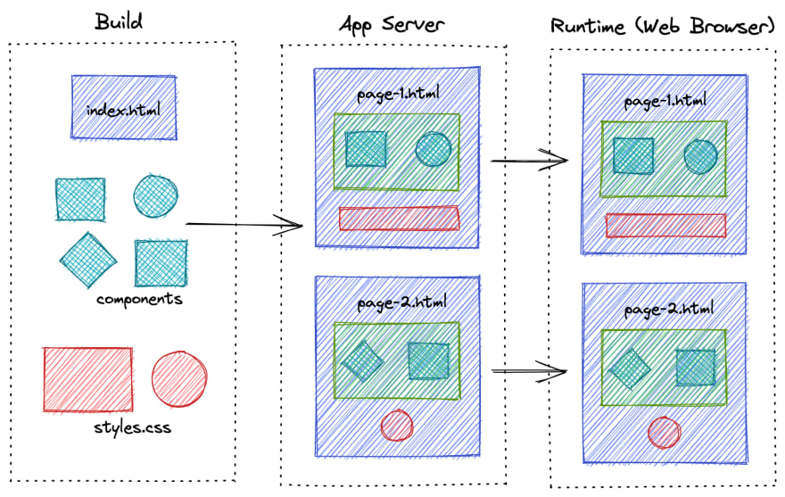
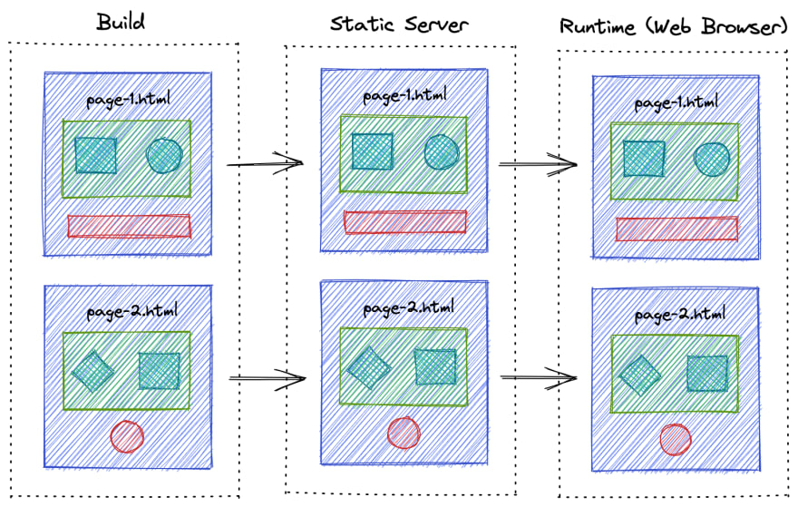

## Client Side Rendering

클라이언트 측에서 렌더링이 이루어지는 방식



Angular와 React와 같은 대부분의 웹 프레임워크가 지원하는 방식입니다.

기본적으로 웹 브라우저는 처음에 빈 HTML 파일을 로드합니다.  
서버는 클라이언트에 필요한 데이터를 전달하고, 클라이언트는 받은 데이터를 이용해 HTML, CSS, JavaScript 등을 활용하여 브라우저에서 렌더링합니다.

CSR은 초기 로딩 시간이 오래 걸릴 수 있지만, 이후 클라이언트 측에서의 상호작용에 대해서는 빠르게 처리할 수 있습니다.  
일반적으로 단일 페이지 애플리케이션(SPA)과 많은 사용자 상호 작용(예: 게임)과 양식 및 채팅 애플리케이션과 같은 매우 역동적인 콘텐츠가 있는 애플리케이션에 적합합니다.

CSR의 주요 단점은 검색 엔진에 최적화되어 있지 않다는 것입니다.  
CSR은 HTML 문서를 클라이언트 측에서 동적으로 렌더링하기 때문에 검색 엔진 크롤러가 이를 인식하지 못하고 색인하지 못할 가능성이 있습니다.  
하지만, CSR 방식에서도 검색 엔진 크롤러가 JavaScript 파일을 실행할 수 있는 경우에는 색인이 가능합니다.  
따라서, CSR 방식에서도 SEO를 고려해야 한다면, 검색 엔진 크롤러가 JavaScript 파일을 실행할 수 있도록 코드를 작성하는 등의 방법을 사용하여 검색 엔진에 내용이 색인될 수 있도록 해야 합니다.

> **클라이언트 측에서 렌더링되는 것**  
> 웹 브라우저가 빈 HTML 파일을 받아오고 JavaScript를 활용해서 브라우저에서 렌더링합니다.
> 모든 관련 파일을 한번에 받아와서 클라이언트의 요청에 따라 다른 화면을 렌더링해서 보여줍니다.
> 필요한 데이터가 있다면 데이터만 서버에 요청해서 받아오고 데이터에 따라서 클라이언트에서 렌더링합니다.
> (사실 하나의 HTML 파일을 사용하기 때문에 Single Page Application이라고 불립니다.)
> 따라서 초기 로딩 시간이 다른 방식에 비해 오래 걸리지만 로딩 후의 상호작용에 대해서는 빠르게 처리할 수 있습니다.
> 처음에 빈 HTML 파일을 받아오기 때문에 검색 엔진 최적화(SEO)가 되어 있지 않다는 단점이 있습니다.
> 하지만 CSR 방식에서도 검색 엔진 크롤러가 JavaScript 파일을 실행해서 색인이 가능하게 하는 방법이 있다고 알고 있습니다.

## Server Side Rendering

서버 측에서 렌더링이 이루어지는 방식



서버는 HTML, CSS, JavaScript 등의 파일을 렌더링한 후, 클라이언트에게 전달합니다.

SSR은 초기 로딩 속도가 빠르지만, 클라이언트 측에서의 상호작용에 대해서는 서버로부터 새로운 HTML 파일을 받아와야 하므로 상대적으로 느립니다.  
사용자가 요청할 때마다 페이지를 요청하고 렌더링하기 때문에, 페이지 서비스 시간은 CSR 애플리케이션 이상입니다.

서버 측에서 HTML 문서를 렌더링하고, 이미 검색 엔진에서 색인된 내용을 보여주기 때문에 CSR보다 SEO에 유리합니다.  
따라서 SEO가 중요한 경우 SSR을 사용하는 것이 좋습니다.

하지만 SSR 방식은 렌더링을 위한 App Server를 관리하기 위한 비용이 발생하기 때문에 무엇이 더 중요한지 잘 판단해야 합니다.

> **서버 측에서 렌더링하는 방식**  
> 서버에서 HTML, CSS, JavaScript 파일을 렌더링한 후 클라이언트에게 전달합니다.
> 서버 측에서 렌더링한 문서를 전달하기 때문에 CSR보다 초기 로딩 속도가 빠르며 검색 엔진 최적화에 유리합니다.
> 하지만 클라이언트 측에서 요청할 때마다 페이지를 렌더링해서 보내줘야 하기 때문에 페이지 서비스 시간은 CSR보다 오래 걸립니다.
> 검색 엔진 최적화가 중요한 경우 SSR 방식을 사용하는 게 좋지만, SSR 방식은 App Server 관리 비용이 추가로 들기 때문에 해당 부분을 고려하여 도입해야 합니다.

## Static Site Generation

정적 사이트 생성 방식



서버에서 사이트를 미리 렌더링한 후, 클라이언트에게 전달합니다.

즉, 서버에서 페이지를 미리 생성하여 캐시하므로 초기 로딩 속도가 매우 빠릅니다.

SSG는 상호작용이 필요하지 않은 사이트에 적합하며, 정적 페이지를 생성하는데 가장 효율적입니다.

> **미리 렌더링된 문서를 클라이언트에게 전달하는 방식**  
> 서버에서 페이지를 미리 생성해서 보내주기만 하면 되기 때문에 초기 로딩 속도가 매우 빠릅니다.
> 정적 페이지로 이루어진 사이트에 가장 효율적인 방법이며, 상호작용이 필요한 사이트에 적합하지 않습니다.

## 비교

|                        | CSR           | SSR        | SSG           |
| ---------------------- | ------------- | ---------- | ------------- |
| 빌드 시간              | 짧음          | 짧음       | 긺            |
| 동적 컨텐츠에 적합     | 적합          | 약간 적합  | 부적합        |
| 검색 엔진 최적화 (SEO) | 부적합        | 적합       | 적합          |
| 페이지 렌더링 시간     | 중간          | 긺         | 짧음          |
| 서버 종류              | Static Server | App Server | Static Server |

특정 페이지들은 CSR로, 특정 페이지들은 SSR로 구현하는 방법도 있음 ⇒ Next.js

---

참고

https://dev.to/pahanperera/visual-explanation-and-comparison-of-csr-ssr-ssg-and-isr-34ea

```toc

```
