**그래프의 모든 노드**를 방문하려면 어떻게 해야 할까?  
가장 대표적인 탐색방법인 DFS와 BFS에 대해 알아보자.

## Depth First Search (DFS)

- 한 길을 깊게 파서 탐색
- 자신과 연결된 노드 중 한 노드를 탐색

### 탐색 과정

다음과 같은 그래프가 있다.

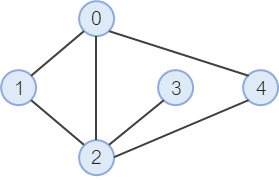

**1. 시작 노드에서 갈 수 있는 노드 중 하나를 선택하여 탐색한다.**

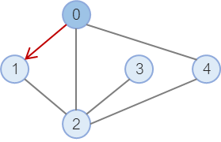

그래프에서 0 을 시작 노드로 정하고, 갈 수 있는 노드 중 1 을 선택했다.

**2. ① 과 같은 방법으로 탐색을 반복한다. (이미 방문한 노드는 선택지에서 제외)**

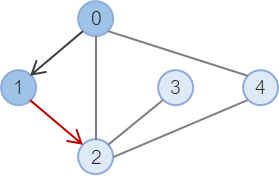

1번 노드에서 갈 수 있는 선택지 0 과 2 중, 0은 이미 방문했으므로 2를 선택한다.

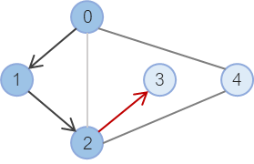

2번 노드에서 갈 수 있는 선택지 0 과 3 중, 0은 이미 방문했으므로 3를 선택한다.

**3. 다음으로 탐색해야 할 노드가 없다면 해당 노드를 호출한 부모 노드로 돌아가 더 탐색해야 할 노드가 있는지 찾는다.**

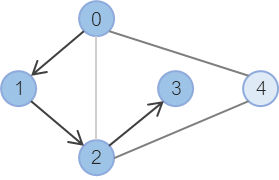

3번 노드에서 더 이상 갈 수 있는 선택지가 없으므로, 2번 노드로 돌아간다.

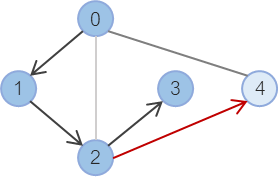

2번 노드에서는 4라는 선택지가 남아있으므로, 4번 노드를 선택한다.

**4. 더 탐색할 노드가 없을 때까지 반복한다.**

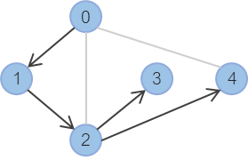

4번 노드에서 0은 이미 방문한 노드이므로 더 이상 탐색할 수 있는 노드가 없으니 2번 노드로 돌아간다.  
2번 노드도 더 이상 탐색할 노드가 없어 1번 노드로 돌아간다.  
1번 노드도 더 이상 탐색할 노드가 없어 0번 노드로 돌아간다.  
시작 노드인 0번 노드도 더 이상 탐색할 노드가 없으므로 탐색을 종료한다.

### 특징

- BFS와 달리 한 레벨에서 여러 노드를 탐색하지 않음
- 탐색할 다음 노드가 없다면 부모 노드 단계로 돌아감 (보통 재귀 사용, 스택&배열로도 가능)
- 구조상 스택오버플로우에 유의해야 함 (깊이 제한을 둬서 방지 가능)
- 최적의 경로로 탐색한다는 보장이 없음

### 언제 사용할까?

- 가능한 모든 경우를 찾아야 할 때

## Breadth First Search (BFS)

- 얕게 여러개 탐색
- 자신과 연결된 모든 노드를 먼저 탐색

### 탐색 과정

다음과 같은 그래프가 있다.


**1. 시작 노드에서 갈 수 있는 모든 노드를 큐에 넣는다.**

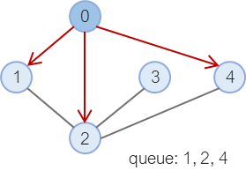

시작 노드인 0번 노드와 연결된 1, 2, 4을 모두 큐에 넣는다.  
큐에 들어간 노드들을 차례대로 탐색할 것이다. 큐는 곧 방문할 노드들을 의미한다.

**2. 큐에 들어간 노드를 하나 뽑아서 ① 과 같은 방법으로 탐색을 반복한다. (이미 방문한 노드는 선택지에서 제외)**

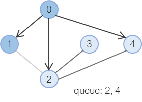

큐는 선입선출이기 때문에 1번 노드가 이번에 탐색할 노드가 된다.  
1번 노드와 연결된 노드 중 0 은 이미 방문한 노드이고, 2 는 곧 방문할 노드로 큐에 들어가 있기 때문에 더 이상 큐에 추가할 노드가 없다.  
큐에서 나올 차례인 2번 노드로 넘어간다.

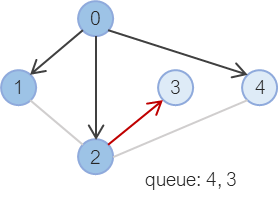

2번 노드와 연결된 3, 4 중에서 4는 이미 큐에 추가되어 있으므로, 3만 큐에 추가해준다.  
큐에서 나올 차례인 4 으로 넘어간다.

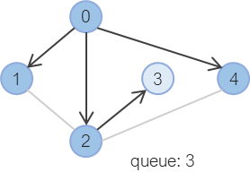

4번 노드는 더 이상 큐에 추가할 노드가 없다.

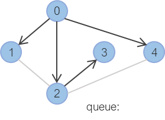

3번 노드도 더 이상 큐에 추가할 노드가 없다.

**3. 큐가 비었다면 탐색을 종료한다.**


### 특징

- DFS와 달리 같은 레벨의 노드들을 먼저 탐색함
- 큐를 통해 방문할 노드들을 선입선출로 꺼냄
- 출발 노드에서 목표 노드까지의 최단 길이 경로를 보장

### 언제 사용할까?

- 그래프의 최단 거리, 최단 경로를 찾을 때

## 비교

둘 다 자주 사용되는 알고리즘이지만, 보통 저 그대로 사용되지는 않고 문제에 맞춰 응용해서 사용한다.  
그래서 두 탐색 방법의 개념을 제대로 알고 이용하는 것이 중요하다.

### 가능한 모든 방법을 구해야 한다면,

- DFS처럼 깊이있게 쭉 들어가며 탐색
- 이미 방문한 노드 표시
- 더 이상 방문할 노드가 없다면 백트래킹

방문할 선택지가 없다면 백트래킹하고 선택지가 남아있다면 방문하는 것이 중요하다.

예를 들어, `[0, 1, 2, 3]`의 가능한 모든 경우를 찾을 때 아래와 같은 순서로 백트래킹하며 탐색할 수 있다.

| 첫번째 | 두번째 | 세번째 | 네번째 | 설명                                                                   |
| ------ | ------ | ------ | ------ | ---------------------------------------------------------------------- |
| 0      | 1      | 2      | 3      | 0 → 1 → 2 → 3 순서로 탐색 & 네번째에서 남은 선택지 X & 세번째로 돌아감 |
|        |        | 3      | 2      | 세번째에서 남은 선택지는 [3] & 3 → 2 탐색 & 두번째로 돌아감            |
|        | 2      | 1      | 3      | 두번째에서 남은 선택지는 [2, 3] & 2 → 1 → 3 탐색 & 세번째로 돌아감     |
|        |        | 3      | 1      | 세번째에서 남은 선택지는 [3] & 3 → 1 탐색 & 두번째로 돌아감            |
| ...    | ...    | ...    | ...    | ...                                                                    |

### 그래프로 나타낼 수 있는 구조에서 최단 거리, 최단 경로를 구해야 한다면,

- BFS처럼 탐색해야 할 노드를 큐에 저장 & 방문안한 노드들만 큐에 추가하며 탐색

이 때 노드간에 cycle이 생기지 않도록 관리해 주는 코드가 꼭 필요하다.

BFS에서 최단 거리 경로가 보장되는 이유는, 출발 노드에서 목표 노드까지의 최단 길이는 결국 둘의 레벨 차이이기 때문이다.

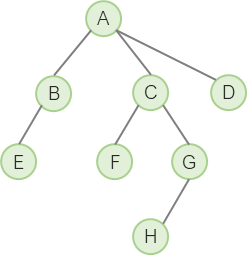

위 그래프에서 A와 G 간의 최단거리를 구한다고 생각하면 알 수 있다.

```toc

```
