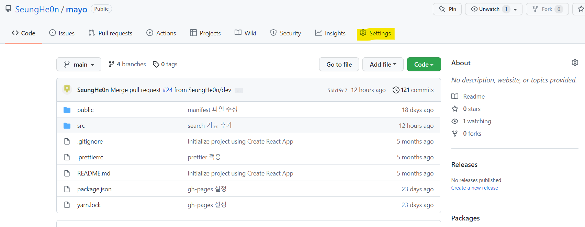
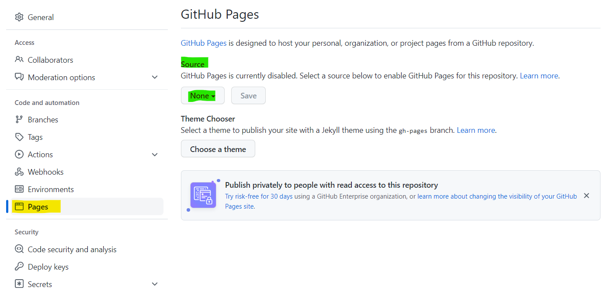
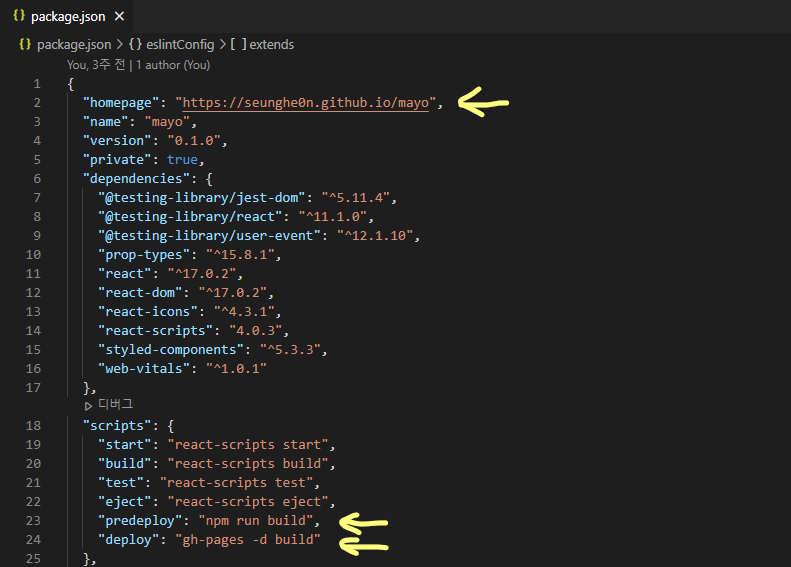
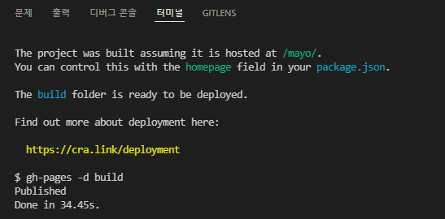
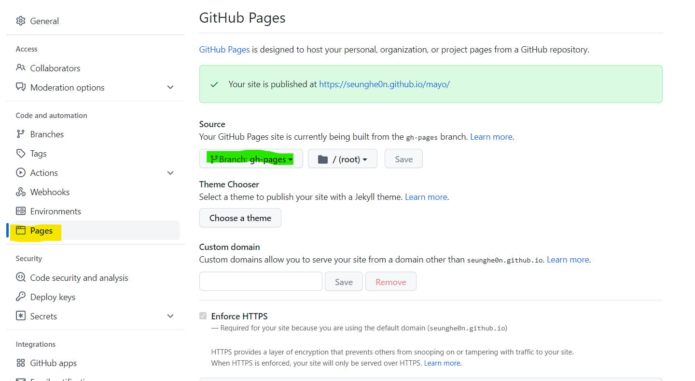

GitHub 레포지토리에 작성한 코드를 무료로 배포하는 방법을 알아봅시다.

이 글은 다음과 같은 사람들을 대상으로 작성되었습니다.

- GitHub 레포지토리에 있는 코드로 웹 배포하려는 사람들
- React를 사용하는 사람들

## GitHub Pages

시작하기에 앞서, GitHub Pages는 뭘까요?  
[GitHub Pages](https://pages.github.com)는 당신의 GitHub repository의 코드를 host해주는 기능입니다.  
GitHub repository에 코드를 올리고 몇가지 설정만 해주면 무료로 웹 배포를 할 수 있습니다.

보통 웹 배포를 직접 하려면 다음 두 가지가 필요합니다.

1. 유료 서버 혹은 낮은 성능의 무료 서버 구하기 (비용 혹은 유지보수 문제)
2. 그 서버에 웹 배포를 위한 여러가지 세팅을 해주기 (복잡함)

직접 웹 배포를 해보는 것도 좋지만 굳이 그럴 필요가 없는 사람들은 GitHub Pages를 쓰는 게 편합니다.

### GitHub Pages 들어가보기

그럼 어디서 설정할 수 있는지 알아봅시다.  
설정하고 싶은 레포지토리에 들어가서 `Settings`에 들어갑니다.



`Pages`에 들어가서 `Source`를 확인하면 현재 GitHub Pages가 비활성화되어 있다고 표시됩니다.  
GitHub Pages를 활성화하려면 바로 아래 `None`이라 표시된 부분을 특정 branch로 설정해야 합니다.  
그 branch의 코드가 호스팅되기 때문입니다.



호스팅될 사이트 주소를 알아내기 위해 `Source`에서 `None` 말고 아무 branch나 눌러서 확인합니다.  
보통 사이트 주소는 `https://ID이름.github.io/repository이름`으로 정해집니다.

그럼 호스팅할 코드는 어떻게 만들어야 할까요?  
웹을 배포하려면 작성한 코드 그대로 올리는 게 아니라, build해서 가볍게 만든 코드를 올려야 합니다.  
GitHub Pages에서 호스팅할 수 있도록 `gh-pages`라는 패키지를 사용해 build합니다.

## gh-pages

`gh-pages`는 GitHub Pages 기능을 이용하기 위해 파일들을 배포하는 패키지입니다.

### 설치하기

배포하고 싶은 프로젝트에 `gh-pages`를 설치합니다.

```bash
npm install gh-pages --save-dev
```

npm 대신 yarn을 사용한다면 add로 설치합니다.

```bash
yarn add gh-pages --save-dev
```

### package.json 수정하기

React 프로젝트의 `package.json` 파일의 다음 부분을 수정해줍니다.

```json
{
  "homepage": "호스팅될 웹사이트 주소",
  // ...
  "scripts": {
    "predeploy": "npm run build",
    "deploy": "gh-pages -d build"
    // ...
  }
}
```



### 배포하기

마지막으로 배포만 남았습니다.

npm을 사용한다면 이렇게,

```bash
npm run deploy
```

yarn을 사용한다면 이렇게.

```bash
yarn deploy
```

명령어를 입력하면 배포가 시작됩니다.



배포가 성공적으로 완료되었다면 gh-pages 브랜치가 새로 생깁니다.  
`Source`의 branch를 gh-pages로 설정해줍니다.



이렇게 Github Pages 기능을 이용해 무료로 웹 호스팅을 했습니다. 🥳

> 만약 변경이 제대로 반영되지 않은 것 같다면 캐쉬를 제거해 보세요.  
> 크롬의 캐쉬 제거 단축키는 `ctrl + R`입니다.

Github Pages는 웹을 여러 개 호스팅하기 힘든 프론트엔드 개발자에겐 정말 좋은 기능이라고 생각합니다.

```toc

```
