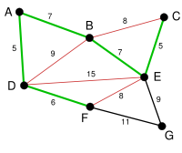

코딩 테스트 문제를 풀다보면 마주치게 되는 크루스칼 알고리즘에 대해 알아봤다.

## What is Kruskal's algorithm?

> 최소 비용 신장 부분 트리를 찾는 알고리즘  
> 변의 개수를 E, 꼭짓점의 개수를 V라고 하면 이 알고리즘의 시간복잡도는 O(ElogV)

노드와 간선으로 이루어진 그래프가 있을 때, 가장 적은 비용으로 노드를 연결하는 방법을 찾는 알고리즘이다.  
주로 간선마다 가중치가 있을 때 가장 적은 비용으로 연결하기 위해 사용한다.

## How it works

[위키백과](https://ko.wikipedia.org/wiki/%ED%81%AC%EB%9F%AC%EC%8A%A4%EC%BB%AC_%EC%95%8C%EA%B3%A0%EB%A6%AC%EC%A6%98)의 크루스칼 알고리즘 예제를 통해 어떻게 동작하는지 알아보자.


간선 옆에 있는 숫자는 변의 가중치를 가리킨다.  
지금은 모든 간선의 색이 검정색이다.  
앞으로 연결된 선은 녹색으로, 연결할 수 없는 선은 빨강으로 나타낸다.


가중치가 가장 작은 간선을 고른다.  
지금처럼 가중치가 가장 작은 선이 두개을 경우 아무거나 골라 선택하면 된다.  
AD 와 CE 중 AD를 선택하고, AD는 연결된 선이기 때문에 녹색으로 변경한다.


나머지 간선 중 가중치가 가장 작은 CE를 선택한다.  
loop를 만들지 않는 선이니까 연결할 수 있다. 녹색으로 바꿔준다.


같은 방식으로 가중치가 6인 DF를 선택한다.


다음으로 가중치가 작은 간선인 AB와 BE 중 임의로 AB를 고른다.  
AB를 연결하기로 결정하면 BD는 loop를 만드는 선이므로 연결할 수 없는 선이 된다.  
만약 AB가 아닌 BE를 연결하기로 결정했다면 AB가 연결할 수 없는 선이 된다.



다음으로 가중치가 작은 BE를 연결하면 BC, DE, FE가 연결할 수 없는 선이 된다.  
BCE 루프를 생성하기 때문에 BC가 빨강색으로 변하고, DEBA 루프를 생성하기 때문에 DE가 빨강색으로 변하고, FEBAD 고리를 생성하기 때문에 FE가 빨강색으로 변한다.


남은 간선 중 가중치가 작은 EG를 연결하고 나면 FG가 연결할 수 없는 선이 되면서 알고리즘이 끝난다.

이렇게 최소 비용 신장 부분 그래프가 완성됐다.

## How to apply

이런 크루스칼 알고리즘을 직접 구현하려면 어떻게 해야 될까?

위 예제를 통해 알아봤을 때 크루스칼 알고리즘 구현의 핵심은 다음과 같다고 생각한다.

1. 연결할 수 있는 선들 중 가중치가 작은 선 먼저 연결하기  
   → 선의 연결여부를 판단할 수 있도록 구현
2. 선을 연결했을 때 loop(cycle)이 형성되는지 판단하기  
   → 각 노드의 부모를 저장해서 연결될 때마다 부모를 최솟값으로 갱신

1번의 선의 연결여부를 판단하는 코드는 알고리즘을 적용할 문제에 따라 다르게 구현하고, 2번의 cycle이 형성되는지 판단하는 코드는 각 노드의 부모를 나타내는 배열을 만들고 간선들을 최소 비용으로 연결할 때마다 두 노드의 부모 중 최솟값으로 갱신해주도록 구현했다.  
이렇게 하면 두 노드의 부모가 같다면 연결했을 때 cycle이 생기는 것을 알 수 있다.  
또, 모든 노드가 연결 가능하다면 알고리즘이 끝났을 때 모든 노드의 부모가 하나로 통일된다.

```toc

```
