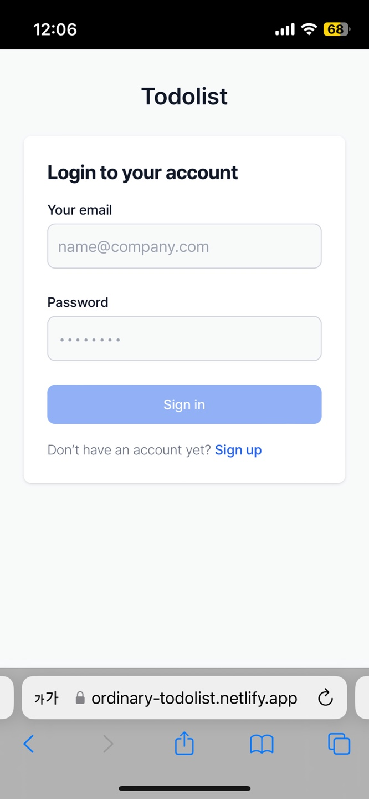
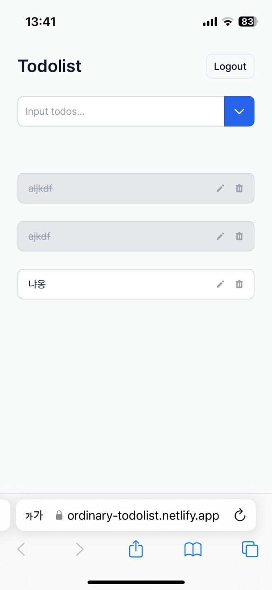
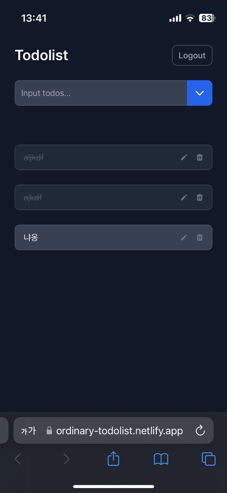
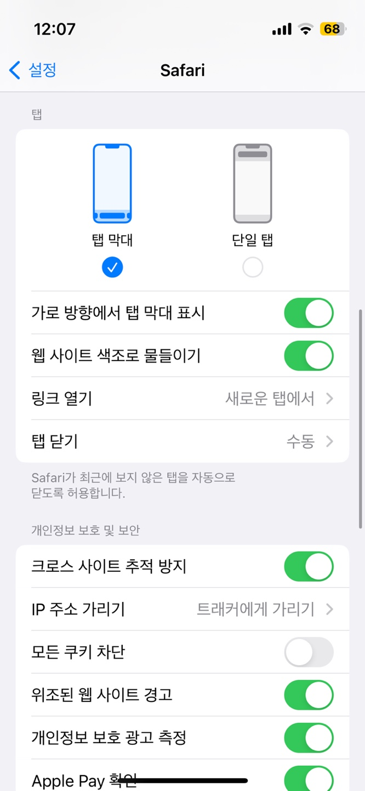

리액트 웹사이트를 만든 후 디바이스별로 스타일이 잘 적용되었는지 확인하던 중 이상한 현상을 발견했다.  
아이폰에서 사파리로 내가 만든 웹사이트를 접속하면 다른 여타 사이트들과 달리 상단바가 까맣게 표시되어서 매우 거슬렸다.

<p style="display:flex">
  
  
</p>

그래서 무엇이 문제인지 알아봤다.

굉장히 삽질을 많이 했지만 결론만 말하자면, 이런 현상이 발생한 이유는 `index.html` 파일에 다음과 같은 코드가 포함되어 있기 때문이었다.

```html
<!DOCTYPE html>
<html lang="en">
  <head>
    <!-- 생략 -->
    <meta name="theme-color" content="#000000" />
  </head>
  <body>
    <!-- 생략 -->
  </body>
</html>
```

`<meta name="theme-color" content="#000000" />`를 제거하고 나면 내 웹사이트에 접속할 때 다른 웹사이트처럼 상단바의 색이 자연스럽게 표시된다.  
라이트모드, 다크모드 둘 다 페이지의 배경색에 맞춰 색이 적용됐다.

<p style="display:flex">
  
  
</p>

지금부터 이렇게 된 이유에 대해 알아보자.

## 사파리의 웹 사이트 색조로 물들이기 기능

아이폰의 사파리에는 `웹 사이트 색조로 물들이기` 기능이 있다. 웹 사이트 틸팅 기능이라고도 한다.  
이 기능은 사파리에 접속했을 때 웹 사이트의 전체적인 색조를 파악한 후 상단바 등 기타 UI에 그 색조를 적용해 자연스럽게 보이도록 도와주는 기능이다.

아이폰 설정에서 사파리 탭에 들어가 기능을 끄거나 켤 수 있다.



자세한 동작 원리는 모르겠지만 상단바를 어떤 색조로 물들일지는 다음에 의해 정해지는 것 같다.

1. html 파일에 테마 컬러가 정해져 있을 경우 해당 테마 컬러의 색조로 물들임
2. 테마 컬러가 정해져 있지 않다면 사파리에서 적합한 색조를 찾아 해당 색조로 물들임
   이 경우, 주로 페이지의 background color가 색조로 정해지는 듯 함

따라서 이 기능이 꺼져 있다면 어떤 웹사이트를 방문하든 상단바의 색상은 라이트 모드일 땐 하얀색, 다크 모드일땐 짙은 회색으로 표시된다.  
이 기능이 켜져 있을 때만 사파리에서 테마 컬러를 판단해 상단바(를 포함한 다른 웹사이트 외의 UI) 색상을 바꿔주는 것이다.  
차라리 `meta` 태그로 `theme-color`를 정해주지 않았다면 알아서 적당한 색조로 물들여주는데 `theme-color`를 검정색으로 정해놔서 부자연스러운 색으로 물들여진 것이다.

## CRA의 index.html 파일

그럼 왜 `theme-color`가 검정색으로 설정되어 있을까? 난 그런 적이 없다.

```html
<meta name="theme-color" content="#000000" />
```

CRA로 리액트 웹 프로젝트를 구성하면 자동으로 `public` 폴더에 `index.html` 파일을 만들어준다.  
이때 이 배포에 근간이 되는 `index.html` 파일에 해당 메타 태그가 자동으로 설정되어 있다.  
그래서 CRA로 만들고 `index.html` 파일에 손대지 않은 프로젝트는 죄다 상단바가 검정색으로 뜬다.

개인적으로 CRA에서 흰색도 아닌 검정색으로 메인테마를 정해주는 이유를 정말 모르겠다.  
차라리 안 정해놓았다면 오히려 자연스럽게 보였을 텐데 이 메타 태그 한줄때문에 하루종일 삽질했다.  
아무래도 대충 살지 말라는 뜻인가 보다.

## 사이트의 테마 컬러를 정하고 싶다면?

나는 테마 컬러를 지정하기 보단 페이지마다 적당한 색조로 알아서 물들이게 하고 싶었기 때문에 CRA가 써준 메타 태그를 지웠다.  
만약 사파리가 알아서 색조를 정해 물들여주는 게 아니라 내가 직접 테마 컬러를 지정하고 싶다면 메타 태그를 이용하면 된다.

```html
<!-- Dark mode theme -->
<meta name="theme-color" media="(prefers-color-scheme: dark)" content="#0e4359" />

<!-- Light mode theme or no preference -->
<meta name="theme-color" content="#a62339" />
```

이렇게 하면 다크모드일 때와, 그렇지 않을 때의 테마 컬러 둘 다 정할 수 있다.

어디까지나 모바일 사파리의 `웹 사이트 색조로 물들이기` 기능을 켰을 때 적용되는 상황이라는 걸 잊지 말자.

---

참고

- [TIME TO UPDATE YOUR THEME-COLOR META TAG FOR SAFARI](https://stuffandnonsense.co.uk/blog/time-to-update-your-theme-color-meta-tag-for-safari)

```toc

```
