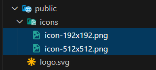
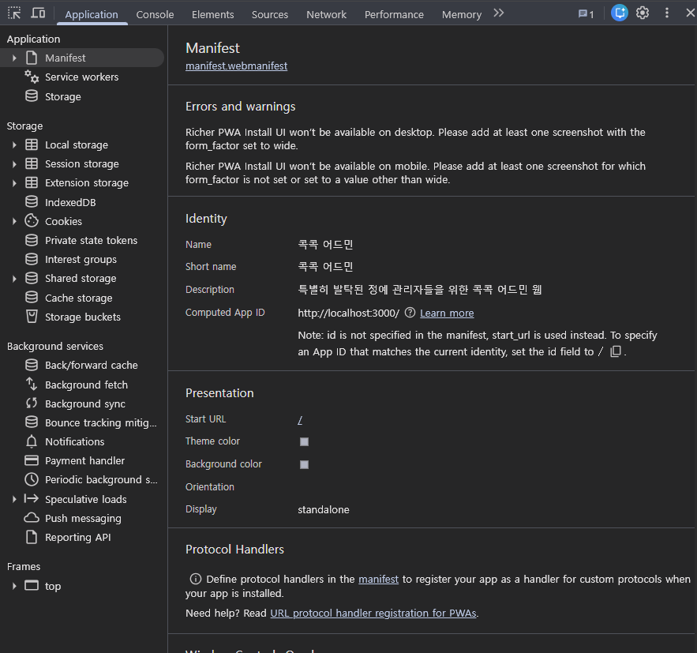
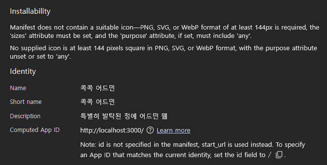
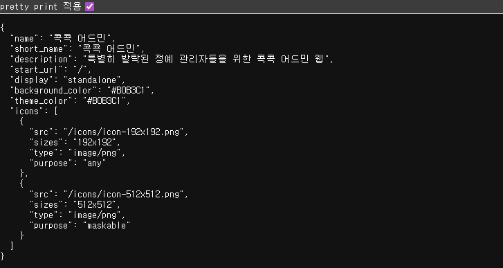
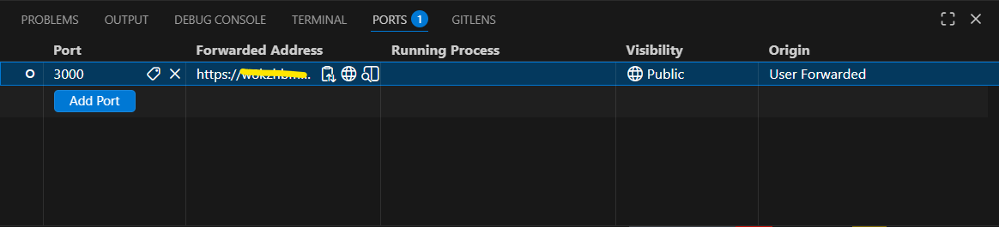

콕콕이라는 앱의 어드민 웹을 개발해서 사용하던 중, 신고/문의 확인하려고 웹으로 접속하는 게 귀찮아졌다.  
그래서 어드민 웹을 폰에 깔아서 궁금할 때마다 쉽게 접근하고 싶은 욕구가 생겼다.

하지만 앱으로까지 만들고 싶지는 않았다.  
앱을 개발해서 운영해 본 결과… 앱이 웹보다 유지보수가 훨씬 힘들었다.

앱스토어의 경우 developer program 때문에 매년 돈도 갖다줘야 하고, ios든 android든 자꾸 자기 생태계를 바꾼다.  
그들은 그들의 일을 하는 거지만…  
해당 os에 적응해야 하는 앱 개발자들은 그들이 매년 발표하는 것에 맞춰서 자꾸 업데이트를 해줘야 한다!!!  
너무 뒤처지면 너 스토어에 제출 못 한다 이놈!! 얼른 업데이트해라!! 하고 호통친다.

그래서 우리가 사용하는 expo만 해도 os에 맞춰서 업데이트되느라 1년에 3번은 major 버전을 업데이트한다.  
진짜 너무 정신없다.

하여튼 실제 비용이 발생하는 점, 유지보수가 좀 더 손이 간다는 점(업데이트 및 심사), 우리의 어드민 웹은 그걸 감수하면서까지 앱으로 만들 이유는 없다는 점에서 PWA를 적용하기로 했다.

PWA를 적용하는 이유는,

1. 웹이지만 모바일에서 앱처럼 표시해주고 싶음
2. 알림 기능을 추가하고 싶음
3. 웹은 보안상 로그인 유지를 안 해놨는데 앱 형식은 로그인 유지를 시켜주고 싶음
   (모바일은 데스크탑에 비해 좀 더 private하고 자주 접속할 수 있는 환경이니까)

위 세 가지가 큰데.

제대로 된 PWA 기능을 적용하기에 앞서 먼저 1번의 세팅 작업을 해보려고 한다.

그러기에 앞서 PWA란 당최 무엇인가.

## PWA란?

**Progressive Web App**  
웹의 접근성과 네이티브 앱의 편의성을 결합한 하이브리드 기술이다.

웹은 앱처럼 설치할 필요가 없고 url을 통해 접근하기 때문에 앱보다 훨씬 접근성이 좋다.  
하지만 웹은 네이티브 앱처럼 모바일에서 가능한 기능들을 사용할 수 없기 때문에 편의성이 떨어진다.

이걸 어떻게 좋은 점만 뽑아먹을 수 없을까 해서 나온 기술이 PWA다.  
웹을 모바일 배경화면에 앱처럼 추가하고 앱처럼 접근할 수 있게 만들어준다.

### 무엇이 내 웹을 PWA라고 정해주는가

PWA에 대해 알아보면서 정확히 어떤 것들이 PWA를 충족시키는 기준이 매우 궁금했었다.  
왜냐하면 ios 사파리의 경우, 어떤 웹사이트든지 홈 화면에 앱처럼 추가가 가능하다. PWA 기능을 따로 설정하지 않은 웹사이트도 말이다.  
이러면 PWA라는 기술을 적용한 웹사이트라는 말이 의미가 있는 것인가?

찾아보니 PWA를 충족시키기 위한 기준은 딱 정해져 있지는 않았다.  
보통 manifest 파일이 있고 서비스 워커를 이용한 기능이 있으면 PWA로 불러주는 듯하다.  
([[MDN] 프로그레시브 웹 앱 소개](https://developer.mozilla.org/ko/docs/Web/Progressive_web_apps/Tutorials/js13kGames) 참고)

**manifest 파일**

manifest 파일을 통해 주소창을 없애 앱 화면처럼 표시해준다든지, 홈 화면에 추가했을 때 어떤 식으로 앱을 표시해준다든지 설정을 할 수 있다.

**서비스 워커**

서비스 워커는 PWA의 핵심 기능이다.  
서비스 워커는 웹과 브라우저, 그리고 네트워크 사이에서 작동하는 프록시 서버와 같은 스크립트이다.  
웹과는 별개의 라이프사이클을 가지고 백그라운드에서 실행된다.

서비스 워커를 이용하면 아래와 같은 기능들을 만들 수 있다.

**1. 캐싱 & 오프라인 작동**

- 네트워크 요청을 가로채서(Intercept) 인터넷이 연결되어 있다면 서버에서 데이터를 가져오고 동시에 복사본을 내 기기에 저장
- 인터넷이 연결되어 있지 않다면 서버 대신 내 기기에 저장된 복사본을 꺼내 보여줌 (오프라인에서도 작동)

**2. 푸시 알림**

- 서버로부터 푸시 메시지를 받으면 서비스 워커가 이를 감지해 알림 표시

**3. 백그라운드 동기화**

- 네트워크 상태가 불안정할 때 보낸 메시지를 기억해뒀다가 연결이 회복되는 순간 자동으로 재전송

이런 서비스 워커는 직접 코드를 짜기엔 복잡해서 보통 pwa 관련 라이브러리를 설치하여 사용한다.

### PWA의 한계

그럼 PWA 만들면 되겠다 뭐 하러 앱 만드냐? 라고 할 수 있는데 PWA도 한계는 있다.  
모바일 기기의 센서를 활용해야 한다거나, 기기의 연락처 혹은 사진첩 같은 시스템에 접근한다거나 등의 모바일에 훨씬 가까운 기능들은 PWA로는 한계가 있을 수 있다.  
그리고 아무래도 PWA는 웹이라는 단계를 거쳐 실행되기 때문에 네이티브 앱보다는 성능 이슈가 있다.

앱 형식이 더 적합한 서비스라면 역시 앱으로 만드는 게 좋다.

## Next에 PWA를 위한 Manifest 메타데이터 구성하기

> next 15.5.7 버전에서 작업 (참고 자료: [Guides: PWAs | Next.js](https://nextjs.org/docs/app/guides/progressive-web-apps))

Manifest 구성은 서비스 워커가 없어도 가능하기 때문에 단순하다.  
PWA 관련 라이브러리들을 사용할 필요도 없다.

### 1. 앱 아이콘 이미지 추가

먼저 `public` 폴더에 앱 아이콘으로 보여줄 이미지 파일을 추가해준다.



192x192 크기는 홈 화면의 앱 아이콘, 앱 서랍 아이콘 등 일상적인 아이콘 용도이고  
512x512 크기는 스플래시 화면이나 그 외 고해상도로 사용되는 아이콘 용도이다.

### 2. manifest 파일 추가

`src/app` 폴더에 `manifest.ts` 혹은 `manifest.json` 파일을 추가한다.  
나는 `manifest.ts` 를 추가했다. json 보다는 ts 로 통일성을 지키고 싶어서.

```tsx
import type { MetadataRoute } from 'next';

export default function manifest(): MetadataRoute.Manifest {
  return {
    name: '콕콕 어드민',
    short_name: '콕콕 어드민',
    description: '특별히 발탁된 정예 관리자들을 위한 콕콕 어드민 웹',
    start_url: '/',
    display: 'standalone',
    background_color: '#B0B3C1',
    theme_color: '#B0B3C1',
    icons: [
      {
        src: '/icons/icon-192x192.png',
        sizes: '192x192',
        type: 'image/png',
        purpose: 'any',
      },
      {
        src: '/icons/icon-512x512.png',
        sizes: '512x512',
        type: 'image/png',
        purpose: 'maskable',
      },
    ],
  };
}
```

`display: "standalone"` 을 추가해줘야 상단 주소창과 하단 네비게이션 바가 사라지는 등 웹보다는 앱처럼 표시해준다.

## PWA 기능을 로컬에서 테스트하기

이제 내가 만든 기능이 제대로 작동하는지 테스트해보자.

PWA는 HTTPS 환경에서 동작한다.  
우리가 로컬에서 테스트하는 localhost는 HTTP 환경이다.  
다행히 보통 브라우저에서 localhost와 `127.0.0.1`은 Secure Origin으로 간주해주기 때문에 따로 HTTPS 설정이 없어도 PWA 테스트가 가능하다.  
하지만! 내 PC가 아닌 모바일 기기로 PWA 기능을 테스트하려고 한다면, 모바일 기기에서는 localhost 환경이 아니기 때문에 PWA 기능 테스트가 불가능해진다.

만들자마자 바로 main에 push하고 배포해서 확인 가능한, 사이트가 언제든지 오류로 터져버려도 상관없는 환경이라면 굳이 번거롭게 로컬에서 테스트할 필요는 없다.  
하지만 대부분은 이 과정이 필요할 것이다!

### manifest 가 제대로 적용되었는지 크롬 개발자 도구로 확인하기

먼저 모바일 기기로 확인해보기 전에 manifest 자체가 제대로 적용되었는지는 PC의 브라우저에서 확인 가능하다.

제대로 적용되었다면, 크롬 개발자 도구의 Application 탭에서 Manifest를 확인해봤을 때 아래와 같이 정보가 잘 반영되어서 뜬다.



만약에 잘못된 게 있으면 어떤 오류가 있다고 뜰 것이다.

예를 들어 아이콘이 잘못되었다면 아래처럼 뜬다.



만약 manifest 파일 연결 자체가 의심된다면 `http://localhost:3000/manifest.webmanifest` 로 접근해보자.

제대로 연결되었다면 링크에 접속했을 때 아래 사진처럼 정보가 잘 뜰 것이다.



### vscode의 포트포워딩 기능으로 만든 임시 HTTPS 주소를 통해 모바일 기기로 접속하기

앞서 말했듯이 내 PC가 아닌 모바일 기기에서는 localhost 환경이 아니기 때문에 PWA 기능 테스트가 불가능하다.  
그래서 따로 HTTPS 주소 환경을 만들어줘야 하는데 vscode의 포트포워딩 기능을 이용하면 쉽게 할 수 있다.

vscode의 PORTS 탭에서 [Forward a Port] 버튼을 눌러 3000 포트를 추가해준다.  
포트의 Visibility를 Private 말고 Public 으로 설정해줘야 깃허브 로그인 없이도 누구나 사이트에 접속 가능해진다.



이제 Forwarded Address의 주소를 모바일 기기에서 접속한 후 테스트할 수 있다!

## 마무리

이렇게 Next에서 PWA Manifest를 설정하고 로컬 환경에서 테스트하는 방법을 알아봤다.  
사실 이것만으로는 서비스 워커를 사용하지 않았기 때문에 당당하게 PWA라고 하기에는 무리가 있다.  
다음에는 서비스 워커를 사용한 기능을 추가해 제대로 된 PWA 웹사이트를 만들어보겠다.

```toc

```
