> 클라우드: Oracle Cloud Infrastructure  
> 이미지: Canonical Ubuntu 20.04

OCI ubuntu 인스턴스에 올려놓은 애플리케이션이 갑자기 작동을 멈췄다.  
확인하려고 PuTTY로 접속했는데 서버의 public key랑 private key가 일치하지 않는다고 떴다.  
분명 과거에 일치했었고 세션에 저장까지 해둔 key인데..!  
해킹된건지 뭐 때문인지 감이 안잡혀서 부트 볼륨을 떼서 분석해보기로 했다.

해당 인스턴스로 SSH 접속이 불가능한 상태이기 때문에 드라이브를 분리한 뒤 다음 과정대로 트러블슈팅했다.

1. 장애가 발생한 인스턴스의 부트 볼륨을 분리
2. 해당 부트 볼륨을 다른 멀쩡한 인스턴스의 블록 볼륨에 연결
3. 디렉토리 마운트 & SSH 키 새로 생성

## 드라이브 분리하기

장애가 발생한 인스턴스의 부트 볼륨 탭에 들어간다.

> **부트 볼륨**이란?  
> 컴퓨트 인스턴스 부트를 위해 사용되는 이미지가 포함된 스토리지 장치

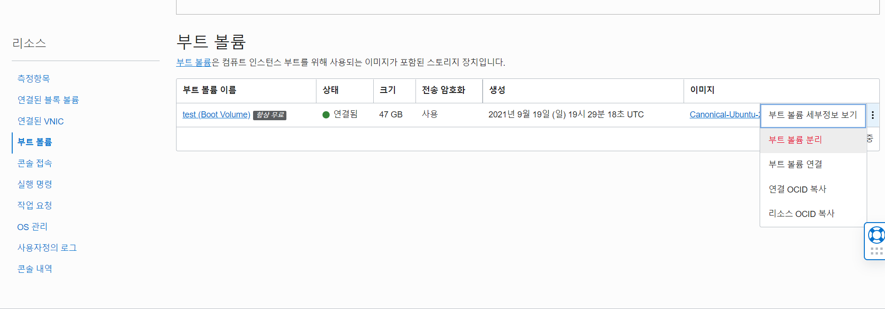

해당 부트 볼륨을 분리해준다.

## 다른 인스턴스에 드라이브 연결하기

멀쩡한 인스턴스의 연결된 블록 볼륨 탭에서 블록 볼륨 연결을 누르면, 연결할 수 있는 볼륨들을 확인할 수 있다.

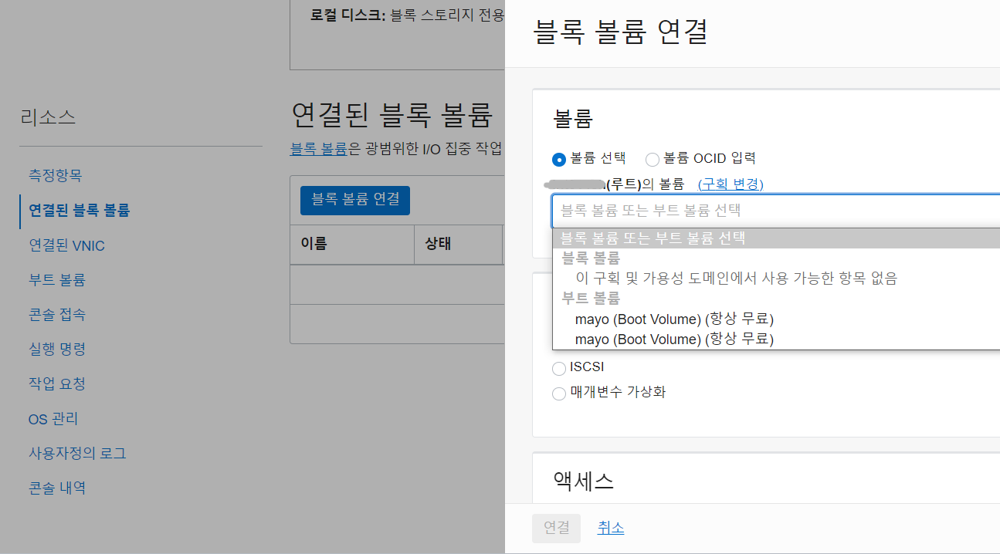

여기서 좀전에 분리한 부트 볼륨을 연결해준다.

위 까지는 테스트용 인스턴스에 여분의 볼륨을 부착(attach)하는 과정이고, 아래부터는 테스트용 인스턴스와 볼륨을 연결(connect)하는 과정이다.  
구체적으로 알고싶다면 [여기](https://docs.oracle.com/en-us/iaas/Content/Block/Concepts/overview.htm#attachtype)를 참고하자.

연결하기 위해서 테스트용 인스턴스에서 iSCSI 접속 명령을 해준다.

> [iSCSI](https://docs.oracle.com/en-us/iaas/Content/Block/Concepts/iscsiinformation.htm)란?  
> Internet Small Computer System Interface  
> 볼륨을 인스턴스에 연결하기 위한 **프로토콜**

연결한 블록 볼륨에서 `iSCSI 명령 및 정보`를 확인하면 iSCSI 명령어를 알려준다.

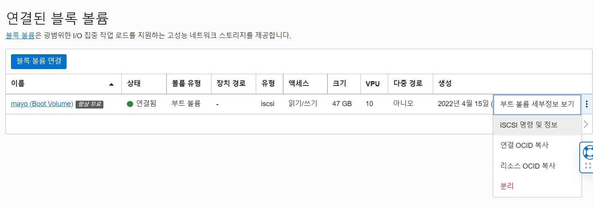

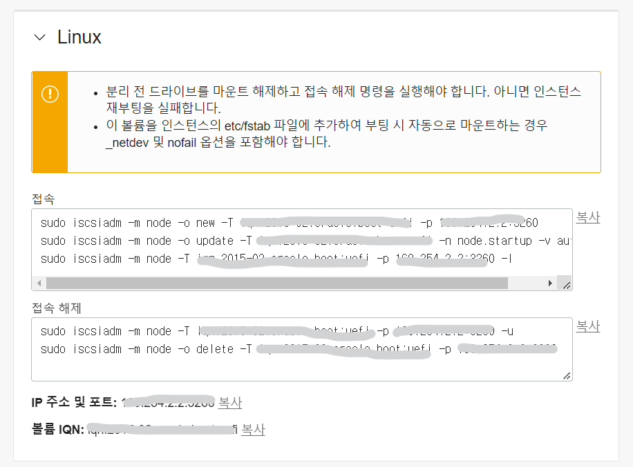

IP 주소랑 볼륨 IQN을 넣은 명령어를 자동으로 만들어줘서 복사만 하면 된다.  
명령어에 대한 설명은 [여기](https://docs.oracle.com/en-us/iaas/Content/Block/Tasks/connectingtoavolume.htm#Connecting_to_a_Volume)에서 참고할 수 있다.

테스트용 인스턴스에 SSH 접속해서 명령어를 실행했을 때, 아래 같이 successful이라고 뜨면 성공적으로 연결된 것이다.

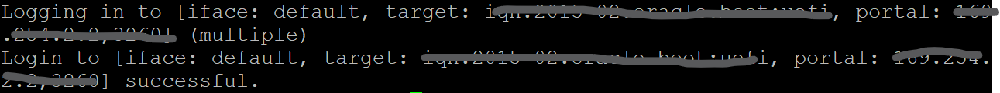

`sudo fdisk -l` 명령어로 연결된 볼륨 목록을 확인할 수 있다.

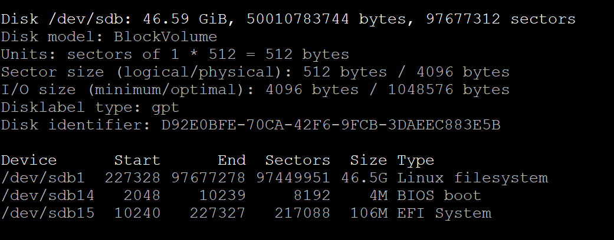

`/dev/sdb`에 잘 연결되어 있다.  
sda, sdb, sdc ... 순으로 이름이 정해지는 듯 하다.

파티셔닝되고 마운트된 상태이므로 다시 파티셔닝하거나 포맷하지 않는다면 더이상 fdisk 명령어를 사용하지 않아도 된다.

## 디렉토리 마운트하기

디스크 안의 데이터에 접근하기 위해서는 디렉토리 마운트를 해줘야 한다.

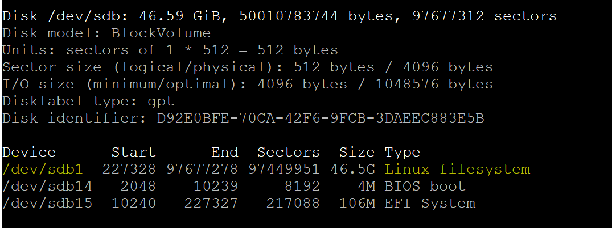

연결된 볼륨 목록 중 리눅스 파일시스템인 `sdb1`에 접근할 것이다.  
마운트할 디렉토리를 만들고 명령어 `sudo mount 디스크주소 디렉토리이름주소`로 디렉토리 마운트를 해준다.

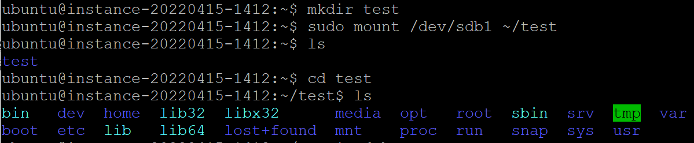

만들어둔 디렉토리에 들어가면 `sdb1` 데이터에 접근할 수 있다.  
SSH 접속이 안되는 문제를 확인하기 위해서 `.ssh` 디렉토리의 `authorized_keys` 파일을 확인해봤다.

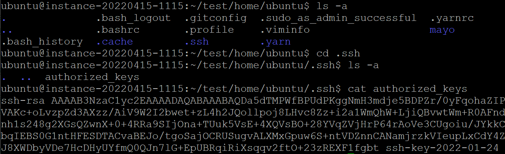

이유는 모르겠지만 가지고 있던 private key와 안 맞는 public key가 들어있었다.

나중에 OCI에서 온 메일에 따르면, 예약된 공용 IP를 가지고 있던 일부 무료티어 고객들이 리소스에 접근할 수 없는 문제가 생겼다고 한다. 😂  
어쩐지 인스턴스 두 개 다 같은 문제가 생겨서 이해가 안갔는데 클라우드 문제였다니!

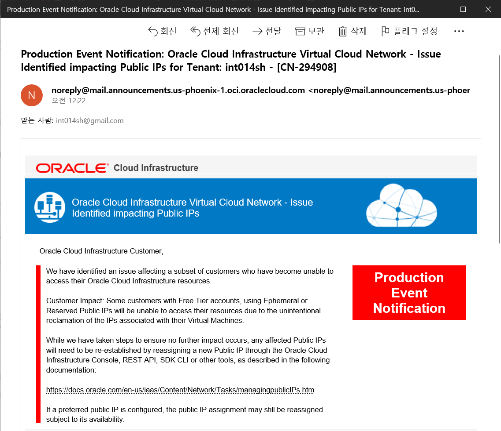

다시 SSH 접속할 수 있도록 만들기 위해 새로운 SSH 키를 생성해야 한다.  
`ssh-keygen -t rsa`로 key pair를 생성했다.

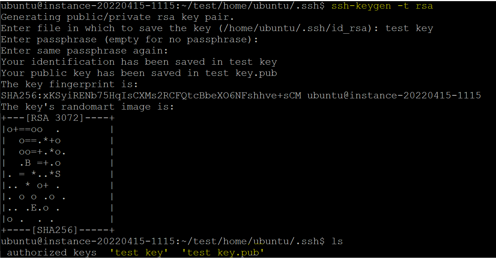

`authorized_keys` 파일의 내용을 새로 생성한 public key로 바꾸고 private key는 따로 복사해둔다.  
테스트용 인스턴스에서 해당 볼륨을 해제하고 원래 있던 인스턴스에 연결하면 복사해둔 private key로 SSH 접속을 할 수 있다! 🎉

아래와 같은 경고가 있으니 테스트용 인스턴스를 앞으로도 사용할 예정이라면 마운트 해제와 접속 해제 명령을 꼭 해주자.

> 분리 전 드라이브를 마운트 해제하고 접속 해제 명령을 실행해야 합니다. 아니면 인스턴스 재부팅을 실패합니다.

### 서버를 재부팅해도 디렉토리에 마운트된 상태 유지하기

`fstab`에 등록해서 서버를 재부팅해도 디렉토리 마운트 상태를 유지할 수 있다.

먼저 `sudo blkid`로 UUID를 알아낸다.  
blkid는 블록 아이디를 의미한다.

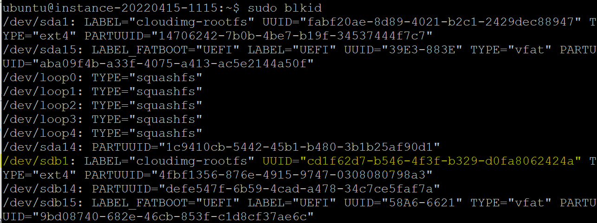

원하는 디스크의 UUID를 복사해서 `fstab` 파일에 붙여넣어야 한다.  
`sudo vi /etc/fstab` 명령어로 `fstab` 파일을 수정할 수 있다.

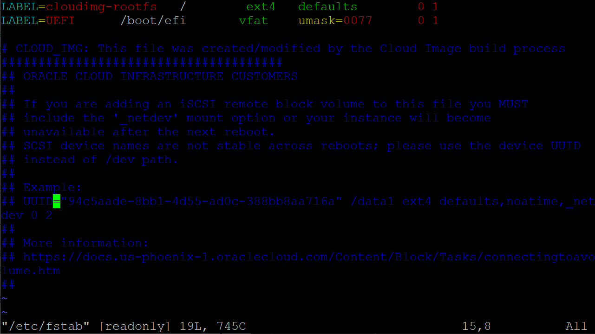

위 파일을 아래처럼 복사한 UUID랑 디렉토리 주소를 넣어서 수정한다.

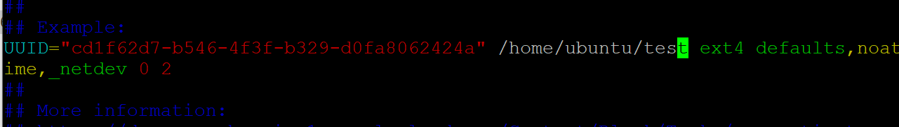

인스턴스에서 알 수 없는 장애가 발생한 경우, 이런 식으로 해당 인스턴스의 부트볼륨을 분리해서 다른 인스턴스에 연결해 원인을 파악하고 문제를 해결할 수 있다.

```toc

```
