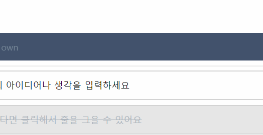

간단한 투두리스트 페이지를 만들던 중 유저가 빈 내용을 입력했을 때 빈 내용을 입력했음을 알려주는 팝업을 띄웠다가 자동으로 사라지게 하고 싶었다.  
팝업 컴포넌트를 만들고 슥 나타나는 애니메이션까지는 추가했는데 다시 슥 사라지게 하는게 어려웠다.

setTimeout 함수를 사용해서 2초 후에 팝업 컴포넌트를 사라지도록 상태 관리하고 1초 동안 fade in 애니메이션을, 1초 동안 fade out 애니메이션을 적용했지만 함수가 시작하는 타이밍과 애니메이션이 시작하는 타이밍이 정확하게 맞아떨어지지 않아 매우 거슬리게 동작했다.

그래서 React unmount animation로 검색해보니 보통 다음과 같은 방법을 쓰는 것 같다.

1. animation, transition 관련 패키지를 사용하기
2. 애니메이션 상태를 결정하는 state를 만들어서 사용하기

웬만하면 패키지는 사용하고 싶지 않았고 두번째 방법은 보통 unmount하는 시점이 특정 행동에 따라 달라질 때 사용하는 것 같았다.  
나는 컴포넌트가 생긴 후 일정 시간 후 알아서 사라지는 단순한 동작이 필요했기 때문에 위 두 방법 대신 `onAnimationEnd`를 이용했다.

> `onAnimationEnd`란?  
> css animation이 끝났을 때 특정 함수를 실행할 수 있는 Event Handler

`onAnimationEnd`를 이용해 팝업 컴포넌트가 나타났다 사라지는 애니메이션을 수행한 뒤, 애니메이션이 끝나면 해당 팝업 컴포넌트를 해제하도록 했다.

```jsx
import styled from 'styled-components';

export default function Popup({ onClose }) {
  return (
    <Wrap onAnimationEnd={onClose}>
      <div>
        <p>빈 내용입니다.</p>
      </div>
    </Wrap>
  );
}

const Wrap = styled.div`
  animation: fadein 0.7s 2 alternate;

  // ...

  @keyframes fadein {
    0% {
      opacity: 0;
      margin-top: -30px;
    }
    50%,
    100% {
      opacity: 1;
      margin-top: 0;
    }
  }
`;
```

`animation: fadein 0.7s 2 alternate`는 fadein 키프레임을 0.7초 동안 재생하는 것을 총 2번, 한번은 정방향, 한번은 역방향으로 실행하는 것을 의미한다.

위 코드에서 `onClose` 함수는 `Popup` 컴포넌트를 해제하는 함수로, `onClose` 함수가 실행되면 `Popup` 컴포넌트는 사라진다.  
`Popup`의 부모 컴포넌트인 `App`에서 `Popup`의 상태를 제어한다.

```jsx
export default function App() {
  // ...

  const [popup, setPopup] = useState(false);
  const onPopup = () => {
    setPopup(true);
  };

  return (
    <Body>
      {popup && <Popup onClose={() => setPopup(false)} />}
      // ...
    </Body>
  );
}
```

이렇게 하면 다음과 같이 내가 원하는 대로 작동한다.



이번은 `onAnimationEnd`를 이용해 간단하게 끝냈지만, 조만간 unmount 애니메이션을 제어하는 날이 온다면 State를 관리해서 사라지도록 만들어야겠다.
