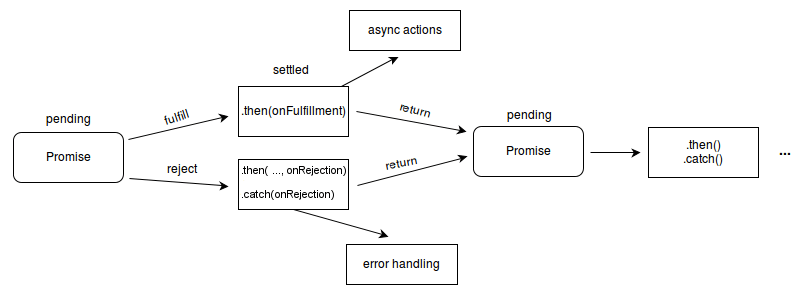

비동기 작업을 제어하기 위해 콜백 함수를 중첩해서 사용하면 콜백 지옥에 빠질 수 있다.  
콜백 지옥에 빠져 코드의 들여쓰기 수준이 너무 깊어졌다면 가독성도 떨어지고 나중에 코드를 수정하기도 힘들어진다.

이런 콜백 지옥을 막기 위해 사용할 수 있는 방법은 다음과 같다.  
이 개념들을 이용해서 **비동기 작업을 동기적으로 표현**할 수 있다.

- Promise
- Generator
- async/await

`Promise`와 `Generator`는 ES6에서, `async/await`는 ES2017에서 도입됐다.

이 중에서 결이 비슷하다고 생각하는 Promise와 async/await를 정리했다.

Generator는 간단하게 설명하면, yield 키워드와 next 메서드를 통해 함수 내부 코드가 순차적으로 실행되도록 제어하는 것이다.

## Promise

Promise 객체는 비동기 작업이 어떻게 될지에 대한 결과를 나타낸다.

Promise는 다음 중 하나의 상태를 가진다.

- 대기(pending): 이행하지도, 거부하지도 않은 초기 상태
- 이행(fulfilled): 연산이 성공적으로 완료됨
- 거부(rejected): 연산이 실패함

대기 상태에서 벗어나 이행 혹은 거부 상태가 됐다면, Promise가 처리(settled)됐다고 말한다.



Promise가 대기 상태에서 연산을 수행하고 이행 혹은 거부 상태로 변한다면(Promise가 처리된다면), `then` 혹은 `catch` 메서드로 추가된 작업을 수행한다.

이 말은, 연산이 다 수행되기 전엔 Promise에 연결된 다른 작업으로 넘어가지 않는다는 것이다.  
그래서 Promise를 통해 비동기 작업을 동기적으로 표현하는 것이 가능하다.

다음은 [MDN](https://developer.mozilla.org/ko/docs/Web/JavaScript/Reference/Global_Objects/Promise#%EC%98%88%EC%A0%9C)에서 가져온 예제 코드이다.

```js
let myFirstPromise = new Promise((resolve, reject) => {
  // 우리가 수행한 비동기 작업이 성공한 경우 resolve(...)를 호출하고, 실패한 경우 reject(...)를 호출합니다.
  // 이 예제에서는 setTimeout()을 사용해 비동기 코드를 흉내냅니다.
  // 실제로는 여기서 XHR이나 HTML5 API를 사용할 것입니다.
  setTimeout(function () {
    resolve('성공!'); // 와! 문제 없음!
  }, 250);
});

myFirstPromise.then((successMessage) => {
  // successMessage는 위에서 resolve(...) 호출에 제공한 값입니다.
  // 문자열이어야 하는 법은 없지만, 위에서 문자열을 줬으니 아마 문자열일 것입니다.
  console.log('와! ' + successMessage);
});
```

## async/await

Promise를 사용하다 보면 `then`같은 메서드가 여러개 붙어 가독성이 나빠질 때가 있다.  
이럴 때 `async/await`를 사용하면 더 가독성도 좋아지고 쓰기도 편해진다.

`async/await`에서도 암시적으로 Promise를 사용하기 때문에 Promise 대신 `async/await`를 사용하는 것은 아니다.  
Promise 대신 보다는 Promise의 `then` 메서드를 열거하는 대신이 더 맞는 표현이라고 생각한다.

### 어떻게 사용할까?

`async`는 비동기 함수 앞에 붙이는 키워드이고, `await`은 Promise 혹은 기다릴 어떤 값 앞에 붙여주는 키워드이다.  
`await`은 `async` 함수 안에서만 사용할 수 있다.

직접 코드를 보고 이해해 보자.

```js
function resolveAfter2Seconds() {
  return new Promise((resolve) => {
    setTimeout(() => {
      resolve('resolved');
    }, 2000);
  });
}

async function asyncCall() {
  console.log('calling');
  const result = await resolveAfter2Seconds();
  console.log(result);
  // expected output: "resolved"
}

asyncCall();
```

`async function`에서 `await` 키워드가 붙은 함수(Promise)가 이행되기 전까진 `await` 뒤의 코드로 넘어가지 않는다.

이런 식으로 비동기 작업마다 `await`를 붙여 Promise의 `then`처럼 사용할 수 있다.

`async/await`의 목적은 여러 Promise의 동작을 동기스럽게 사용하는 것으로, Generator와 Promise를 묶는 것과 유사하다.

### async

`async` 함수는 **항상 Promise를 반환**한다.  
만약 `async` 함수의 반환값이 명시적으로 Promise가 아니라면 암묵적으로 Promise로 감싸진다.

예를 들어 그냥 1을 반환하는 foo 함수가 있다면,

```js
async function foo() {
  return 1;
}
```

위 foo 함수는 아래 코드랑 같다고 볼 수 있다.  
반환값에 Promise를 넣지 않아도 자동으로 Promise로 감싸준다.

```js
function foo() {
  return Promise.resolve(1);
}
```

### await

`await` 뒤에 Promise를 써서 해당 Promise가 처리될 때까지 `async` 함수를 멈출 수 있다.  
Promise가 처리되었다면 멈춘 부분부터 실행된다.

```
[rv] = await expression;
```

- expression  
  Promise 혹은 기다릴 어떤 값 (보통 Promise 사용)

- rv  
  Promise에 의해 만족되는 값이 반환됨  
  Promise가 아닌 경우에는 그 값 자체가 반환됨

반환되는 값이 중요하지 않다면 `await expression;`과 같이 `[rv] = `를 생략하고 사용하면 된다.

`async` 함수의 반환값이 Promise가 아니라면 Promise로 감싸주는 것처럼, `await` 뒤의 expression이 Promise가 아니라면 resolved Promise로 변환시킨다.

### async/await를 사용해서 코드 간결하게 만들기

실제로 썼던 코드를 생략해서 가져왔다.

코드에서 `channelManager()`는 Promise를 반환하는 함수다.

```jsx
channelManager.create().then((category) => {
  channelManager.create(category.id).then((channel) => {
    channel.send(channelText);
  });
  channelManager.create(category.id).then((channel) => {
    channel.send(channelText);
  });
});
```

위 코드에 `async/await`를 적용해보자.

```jsx
const category = channelManager.create();

const channel1 = await channelManager.create(category.id);
await channel1.send(channelText);

const channel2 = await channelManager.create(category.id);
await channel2.send(channelText);
```

위 코드랑 아래 코드가 정확히 같게 동작하지는 않지만, 얼추 비슷하게 수정했다.

한눈에 보기에도 `async/await`를 사용한 게 훨씬 간결하다.  
앞으로 Promise를 사용할 땐 `async/await` 문법도 같이 사용하도록 하자.

```toc

```
