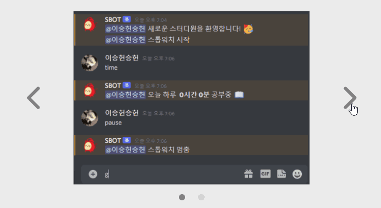
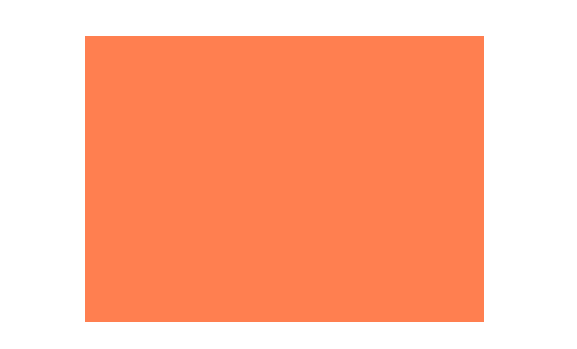
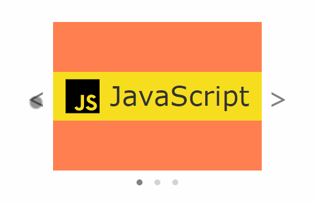

React로 캐러셀을 만들어보자.  
캐러셀이 움직이게 만드는 건 어렵지 않았고 CSS를 다루는데 시간을 많이 뺏겨서 CSS를 중심으로 설명할 것이다.

## Carousel이란?

직역하자면 '회전목마'로, 사진들이 순환하며 돌아가는 슬라이드 쇼를 나타낸다.

백문이 불여일견. 애플 홈페이지에 들어가 보자.


이런 식으로

- 사진이 가로로 나열
- 왼쪽, 오른쪽 버튼을 통해 이동 가능

하다면 보통 캐러셀이라고 불린다.

## 내가 만들 Carousel

다양한 캐러셀들이 있지만 아래와 같이 간단한 모양의 캐러셀을 만들 것이다.



내가 만들 캐러셀은 특징은 이렇다.

- 사진을 하나씩만 보여주고 양 옆으로 넘길 수 있음
- 아래에 점을 통해 몇번 째 사진을 보고 있는지 표시

## 1. 창틀 만들기

가로로 나열된 사진 여러개 중 하나만 보여주기 위해서, 일부분만 보여주는 창틀을 하나 만든다.

일단 귀여운 코랄색 네모를 하나 만든다.  
사진들을 넣었을 때 창틀에서 넘치지 않도록 `overflow: hidden`을 꼭 넣어줘야 한다.

```jsx
<div class="window"></div>
```

```scss
.window {
  background: coral;
  width: 350px;
  height: 250px;

  overflow: hidden;
}
```



이제 이 네모 안에 사진들을 넣을 것이다.

## 2. flex box 만들고 사진 넣어주기

사진들을 그냥 넣으면 세로로 나열되기 때문기 가로로 나열하도록 flex 박스를 하나 만들어서 사진들을 묶어줘야 한다.

아무 사진이나 세개 넣어줬다 ㅎㅎ

```jsx
<div className="window">
  <div className="flexbox">
    <div
      className="img"
      style={{
        backgroundImage: `url("https://img.shields.io/badge/-JavaScript-F7DF1E?style=flat-square&logo=JavaScript&logoColor=black")`,
      }}
    ></div>
    <div
      className="img"
      style={{
        backgroundImage: `url("https://img.shields.io/badge/-React-61DAFB?style=flat-square&logo=React&logoColor=black")`,
      }}
    ></div>
    <div
      className="img"
      style={{
        backgroundImage: `url("https://img.shields.io/badge/-TypeScript-3178C6?style=flat-square&logo=TypeScript&logoColor=white")`,
      }}
    ></div>
  </div>
</div>
```

```scss
.window {
  background: coral;
  width: 350px;
  height: 250px;

  overflow: hidden;
}

.flexbox {
  display: flex;
}

.img {
  width: 350px;
  height: 250px;
  background-position: 50% 50%;
  background-size: contain;
  background-repeat: no-repeat;
  flex: none;
}
```


화면상에는 첫번째 사진만 나타나지만, 보이지 않는 오른쪽 공간에 다른 사진 두개가 숨어있다.

사진들을 묶어줄 플렉스 컨테이너엔 `display: flex`를 써주고 아이템에는 `flex:none`를 써줘야 한다.

### `flex: none`을 사용한 이유

사진들을 묶어준 flex 컨테이너보다 사진들이 더 크다.  
flex 속성이 기본값이라면 플렉스 컨테이너의 남은 공간을 채우려 늘어나지는 않지만, 플렉스 컨테이너의 크기를 넘지 않기 위해 최소 크기로 줄어든다.  
기본값으로 한다면 저 작은 창에 사진들이 욱여넣어진다.. 따라서 꼭 `flex: none` 또는 `flex: 0 0 auto`로 설정해주자.

### `img` 태그가 아니라 `div` 태그를 사용한 이유

사진 비율을 유지한 채로 창 안에 예쁘게 담으려면, `img` 태그를 사용했을 때 `object-fit: contain`을 사용할 수 있다.  
하지만 `object-fit`은 IE에서 사용할 수 없기 때문에 `img` 태그의 `object-fit`을 사용하는 대신 호환성이 좀 더 좋은 `div` 태그의 `background-size` 속성을 사용했다.

`background-image` 속성에 사진 URL을 넣어주고, 아래처럼 써주면 비율이 유지된 채로 사진이 이쁘게 창 안에 들어간다.

```scss
background-position: 50% 50%;
background-size: contain;
background-repeat: no-repeat;
```

### `img` 태그를 사용하려면,

아래처럼 약간만 바꿔주면 똑같이 나온다.

```jsx
<div className="window">
  <div className="flexbox">
    
    
    
  </div>
</div>
```

```scss
.window {
  // 위랑 동일
}
.flexbox {
  // 위랑 동일
}

img {
  width: 350px;
  height: 250px;
  object-fit: contain;
  flex: none;
}
```

## 3. 버튼 누르면 사진 넘어가게 만들기

`useState`, `useEffect`, `useRef`를 사용해서 만들었다.

현재 몇 번째 사진을 보고 있는지 변수로 기억하고 버튼 입력이 들어오면 해당 변수를 조작해준다.  
몇 번째 사진을 보고 있는지에 따라 보여주는 사진을 다르게 해주고, 아래 점 표시도 다르게 해준다.

`margin-left`를 음수로 줘서 옆으로 넘어가는 것처럼 만든다.  
`margin-left: -100%`로 설정하면 두번째 사진으로, `margin-left: -200%`로 설정하면 세번째 사진으로 넘어가는 걸 확인할 수 있다.

```jsx
const App = () => {
  const images = useRef([
    {
      src:
        'https://img.shields.io/badge/-JavaScript-F7DF1E?style=flat-square&logo=JavaScript&logoColor=black',
    },
    {
      src:
        'https://img.shields.io/badge/-React-61DAFB?style=flat-square&logo=React&logoColor=black',
    },
    {
      src:
        'https://img.shields.io/badge/-TypeScript-3178C6?style=flat-square&logo=TypeScript&logoColor=white',
    },
  ]);

  const [current, setCurrent] = useState(0);
  const [style, setStyle] = useState({
    marginLeft: `-${current}00%`,
  });
  const imgSize = useRef(images.current.length);

  const moveSlide = (i) => {
    let nextIndex = current + i;

    if (nextIndex < 0) nextIndex = imgSize.current - 1;
    else if (nextIndex >= imgSize.current) nextIndex = 0;

    setCurrent(nextIndex);
  };

  useEffect(() => {
    setStyle({ marginLeft: `-${current}00%` });
  }, [current]);

  return (
    <div className="container">
      <div className="slide">
        <div
          className="btn"
          onClick={() => {
            moveSlide(-1);
          }}
        >
          &lt;
        </div>
        <div className="window">
          <div className="flexbox" style={style}>
            {images.current.map((img, i) => (
              <div key={i} className="img" style={{ backgroundImage: `url(${img.src})` }}></div>
            ))}
          </div>
        </div>
        <div
          className="btn"
          onClick={() => {
            moveSlide(1);
          }}
        >
          &gt;
        </div>
      </div>
      <div className="position">
        {images.current.map((x, i) => (
          <div key={i} className={i === current ? 'dot current' : 'dot'}></div>
        ))}
      </div>
    </div>
  );
};
```

```scss
.container {
  display: flex;
  flex-direction: column;
  align-items: center;
}

.slide {
  display: flex;
  align-items: center;
}

.window {
  background: coral;
  width: 350px;
  height: 250px;

  overflow: hidden;
}

.flexbox {
  display: flex;
}

.img {
  width: 350px;
  height: 250px;
  background-position: 50% 50%;
  background-size: contain;
  background-repeat: no-repeat;
  flex: none;
}

.btn {
  display: flex;
  align-items: center;
  cursor: pointer;
  font-size: 3.3rem;
  color: gray;
  padding: 0 10px;
}

.position {
  margin-top: 15px;
  display: flex;
  justify-content: center;
}

.dot {
  background: lightgray;
  border-radius: 100%;
  height: 10px;
  width: 10px;
}
.dot + .dot {
  margin-left: 20px;
}

.current {
  background: gray;
}
```



### `margin-left` 대신 `transform` 속성 사용하기

`margin-left: 100%` 대신 `transform: translate(-100%)`을 사용해도 같게 동작한다.

하지만 `transform` 속성보다 `margin`이 호환성이 더 좋아서 `margin`을 사용했다.

```toc

```
