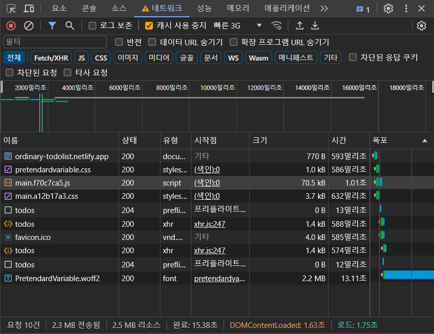
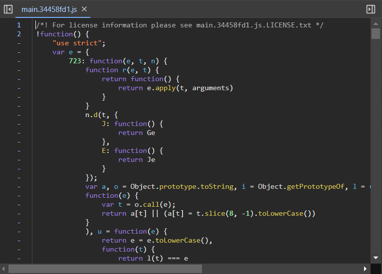
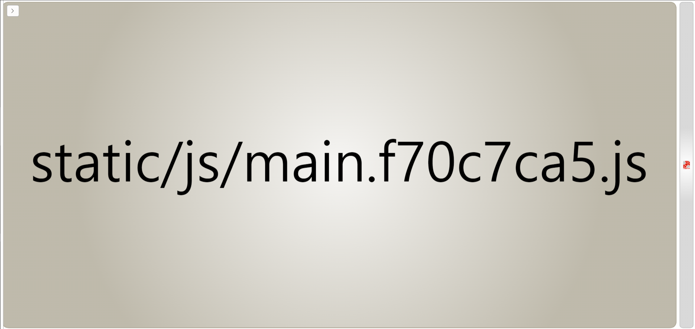
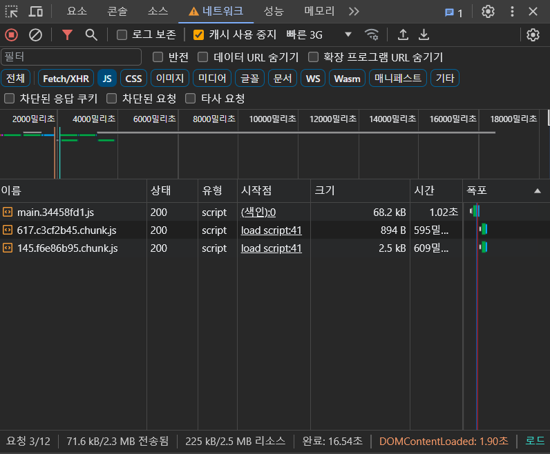

React 프로젝트를 최적화하는 방법 중 코드 분할과 지연 로딩에 대해 알게 되었다.

> 💡 **코드 분할(Code splitting)이란?**  
> 하나의 빌드 파일을 한 번에 다운로드하는 대신 여러 파일로 분할해 필요할 때만 다운로드하는 것이다.
> 초기 리소스 다운로드 시간을 줄일 수 있다.
> 불필요한 코드 또는 중복되는 코드 없이 적절한 사이즈의 코드가 적절한 타이밍에 로드되는 것이 중요하다.

> 💡 **지연 로딩(Lazy loading)이란?**  
> 처음 페이지가 로드될 때가 아닌, 사용자가 서비스를 이용하는 중 해당 코드가 필요해지는 시점에 분할되어 있던 코드가 로드되어 실행되는 것이다.
> 처음에 한 번에 로드되지 않고 지연되었다가 로드되므로 지연 로딩이다.

따로 코드 분할하지 않으면 통합된 하나의 빌드 파일을 가지게 되는데, 그러면 처음 페이지에 접속할 때 그 통합된 빌드 파일을 로드하기 때문에 당장 필요하지 않은 코드까지도 로드하게 된다.

내 투두리스트 프로젝트에서도 투두리스트 페이지에 들어가든, 로그인/회원가입 페이지에 들어가든 `main.어쩌구저쩌구.js`라는 똑같은 하나의 빌드 파일을 로드한다.



투두리스트 페이지에 들어가도 불필요한 로그인 기능까지 같이 로드되는 것이다.

그래서 빌드 파일을 분할해 필요한 코드만 로드하고 나머지는 필요할 때 로드하도록 지연하는 과정을 정리해봤다.

## 빌드 파일 분석하기

그래서 빌드 파일 안이 도대체 어떻게 생겼는데?  
불필요한 코드가 있는지 한번 직접 알아보자.



잘 모르겠다.

빌드된 파일은 불필요한 데이터를 없애고 압축한 상태이기 때문에 브라우저는 잘 알아보지만 인간은 당연히 알아보기 힘들다.

그래서 빌드 파일을 분석해주는 `webpack-bundle-analyzer`와 `cra-bundle-analyzer` 라이브러리를 사용했다.  
라이브러리를 devDepenencies로 설치하고 명령어 `npx cra-bundle-analyzer`를 실행하면 다음과 같이 빌드 파일을 시각적으로 분석해준다.



커다란 하나만 있는 건 잘못된 게 아니다.  
따로 코드를 분할하지 않아 빌드 파일이 하나로 통합되어서 그런 것이다.

## `lazy`와 `Suspense`로 코드 분할하기

`lazy` 함수와 `Suspense` 컴포넌트를 사용하면 지연 로딩할 코드를 분할할 수 있다.
컴포넌트를 동적으로 import해 코드를 분할시키는 것이다.

코드 분할 전의 코드는 이렇다.

```ts
import AuthPage from 'src/pages/AuthPage';
import TodolistPage from 'src/pages/TodolistPage';

import Authorization from 'src/components/Authorization';
import LoginForm from 'src/components/LoginForm';
import RegisterForm from 'src/components/RegisterForm';

export default function App() {
  return (
    <BrowserRouter>
      <Routes>
        <Route element={<Authorization />}>
          <Route path="/" element={<TodolistPage />} />
          <Route element={<AuthPage />}>
            <Route path="/login" element={<LoginForm />} />
            <Route path="/register" element={<RegisterForm />} />
          </Route>
        </Route>
      </Routes>
    </BrowserRouter>
  );
}
```

로그인된 사용자인지를 판단하는 `Authorization` 컴포넌트는 어떤 페이지가 로딩되더라도 필요하다.  
하지만 투두리스트 페이지, 로그인 페이지, 회원가입 페이지는 다른 페이지의 컴포넌트가 필요하지 않다.

그래서 공통으로 사용되는 `Authorization` 컴포넌트를 제외한 나머지 컴포넌트들을 `lazy`와 `Suspense`를 사용해 동적으로 import했다.

```ts
import Authorization from 'src/components/Authorization';

const AuthPage = lazy(() => import('src/pages/AuthPage'));
const TodolistPage = lazy(() => import('src/pages/TodolistPage'));
const LoginForm = lazy(() => import('src/components/LoginForm'));
const RegisterForm = lazy(() => import('src/components/RegisterForm'));

export default function App() {
  return (
    <BrowserRouter>
      <Suspense
        fallback={
          <div className="h-screen">
            <Spinner />
          </div>
        }
      >
        <Routes>
          <Route element={<Authorization />}>
            <Route path="/" element={<TodolistPage />} />
            <Route element={<AuthPage />}>
              <Route path="/login" element={<LoginForm />} />
              <Route path="/register" element={<RegisterForm />} />
            </Route>
          </Route>
        </Routes>
      </Suspense>
    </BrowserRouter>
  );
}
```

코드가 분할되었는지 `cra-bundle-analyzer`로 확인해보자.


전과 다르게 빌드 파일이 여러 개로 쪼개져 있다.

직접 웹사이트에 들어가 네트워크 탭을 확인하면 투두리스트에 필요한 코드만 로드된 걸 확인할 수 있다.



## 코드 분할 결과

코드는 잘 분할되어 투두리스트 페이지에서는 투두리스트와 관련된 소스만 로드된다.

그런데 빌드 파일의 용량을 확인해보면 코드 분할 전 하나의 빌드 파일일 때보다 코드 분할 후 여럿의 빌드 파일들의 용량이 더 크다.  
코드 분할로 인해 페이지마다 불필요한 코드가 로드되지는 않으나, 코드 분할 전보다 로드해야 할 JavaScript 파일의 총 크기가 약간 늘어나 오히려 성능에 도움 되지 않는다.  
이건 코드 분할로 인해 감소하는 코드 크기보다 코드 분할로 인해 추가된 코드의 크기가 더 크기 때문이라고 생각된다.

그래서 코드가 크지 않다면 코드 분할을 적용하지 않는 것이 더 성능에 좋을 것 같다.

프로젝트를 최적화한 내용은 [해당 Pull Request](https://github.com/heony704/ordinary-todolist/pull/8)에서 더 자세히 확인할 수 있다.

---

참고

- 프론트엔드 성능 최적화 가이드, 유동근 지음
- [React lazy](https://react.dev/reference/react/lazy)
- [React Suspense](https://react.dev/reference/react/Suspense)

```toc

```
