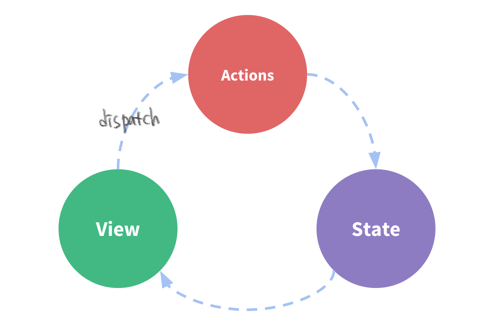
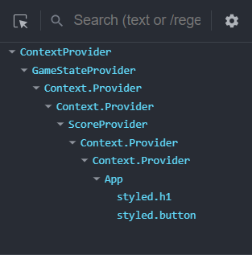
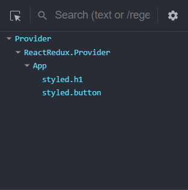
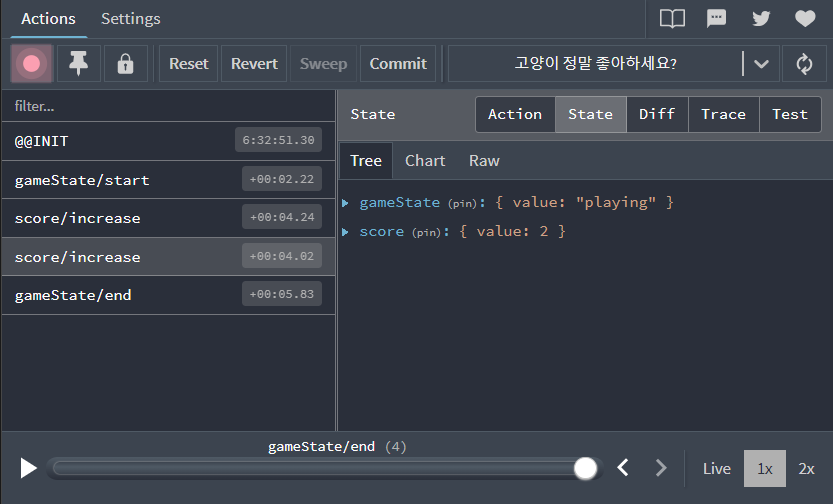

React Redux를 어떻게 적용했는지, Context API와 React Redux는 무엇이 다른지 정리해봤다.

> React Redux를 적용할 때 **Redux Toolkit**을 함께 사용했다.  
> React Redux 공식문서에서도 Redux Toolkit을 사용하길 권장하며, 실제로 사용해보니 작성해야할 코드가 줄어들어 편했다.

## React Redux

Redux는 action이라고 불리는 이벤트를 사용해 상태를 관리하는 패턴이며, React Redux는 Redux를 React에서 사용할 수 있는 라이브러리이다.  
React Redux는 Redux store에 상태를 저장하고 action을 dispatch해서 store의 상태를 변경한다.



React Redux는 현재 React에서 지정한 공식 Redux UI 바인딩이다.  
만약 React를 사용중이며 UI 바인딩에 Redux 개념을 이용하고 싶다면 React Redux 라이브러리가 가장 권장된다는 뜻이다.

React에서 제공되는 기능과 다른 점은 React Redux는 성능 최적화를 해준다는 것이다.  
React는 상태 업데이트가 일어난다면 값이 변하지 않았더라도 착실하게 전부 리렌더링해주기 때문에 불필요한 리렌더링을 피하기 위해 별도로 최적화를 해줘야 한다.  
React Redux는 오직 상태의 값이 변할 때만 렌더링이 일어나도록 내부적으로 성능 최적화가 구현되어있다.

### store 만들기

`configureStore` 함수로 상태들을 저장할 store를 만든다.  
옵션에 reducer를 명시해 store에 여러 reducer들을 연결할 수 있다.  
reducer 이외에도 middleware, devTools 등 다른 옵션도 존재한다.

지금은 아무 reducer도 만들지 않았기 때문에 비워둔다.

```tsx
const store = configureStore({
  reducer: {},
});

export default store;
```

### Provider로 store 제공하기

store를 전달한 Provider 컴포넌트로 App 컴포넌트를 감싸준다.

이제 App 컴포넌트 트리에서는 store의 상태를 사용할 수 있다.

```tsx
ReactDOM.createRoot(document.getElementById('root')!).render(
  <React.StrictMode>
    <Provider store={store}>
      <App />
    </Provider>
  </React.StrictMode>,
);
```

### createSlice로 action, reducer 만들기

`createSlice` 함수로 초기 상태와 reducer 함수를 받아 action 생성 함수와 reducer를 만든다.  
name 옵션에는 slice 이름, initialState 옵션에는 초기 상태 값, reducers 옵션에는 어떤 action일 때 어떤 상태 변경이 일어나는지를 정의한다.

```tsx
const initialState: GameState = {
  value: 'ready',
};

const gameStateSlice = createSlice({
  name: 'gameState',
  initialState,
  reducers: {
    ready: (state) => {
      state.value = 'ready';
    },
    start: (state) => {
      state.value = 'playing';
    },
    end: (state) => {
      state.value = 'over';
    },
  },
});

export const { ready, start, end } = gameStateSlice.actions;
export default gameStateSlice.reducer;
```

### store에 만들어둔 reducer 연결하기

`createSlice` 함수로 만든 reducer들을 store에 연결한다.

```tsx
const store = configureStore({
  reducer: {
    gameState: gameStateReducer,
    score: scoreReducer,
  },
});

export default store;
```

### 만든 상태와 action 생성 함수 사용하기

`useSelector` 훅을 통해 원하는 store 상태를 가져올 수 있고 `useDispatch` 훅을 통해 원하는 action을 생성해 상태를 변경시킬 수 있다.

TypeScript를 사용하기 때문에 타입을 명시해준 커스텀 훅을 사용했다.

```tsx
export default function App() {
  const gameState = useTypedSelector((state) => state.gameState.value);
  const dispatch = useTypedDispatch();

  return (
    <>
      <Title>고양이 정말 좋아하세요?</Title>
      <StartButton onClick={() => dispatch(start())} disabled={gameState !== 'ready'}>
        증명하기
      </StartButton>
      {gameState === 'playing' && <Game />}
      {gameState === 'over' && <GameResult />}
    </>
  );
}
```

## Context + useReducer vs React Redux

Context API와 React Redux는 비교 대상이 아니다.  
Context API는 props 전달 없이 상태를 제공할 수 있는 방법일 뿐 상태를 관리할 수 없지만 React Redux는 상태 관리 라이브러리이기 때문이다.

하지만 Context와 useReducer를 같이 사용하는 방법은 React Redux와 매우 비슷하기 때문에 Context가 아닌 Context + useReducer로 비교해보려 한다.

### 공통점

저장소(Context 혹은 Store)를 만들어 action을 dispatch하는 과정이 동일하다.

상태를 전역적으로 사용할 수 있다.

상태 변경에 관한 로직이 한군데에 모여있어 파악하기 편하다.

### 차이점

Context + useReducer보다 React Redux + Redux Toolkit이 코드 작성하기 더 편했다.

Context API는 상태를 만들 때마다 Provider를 만들고 중첩해야해서 복잡했는데 React Redux는 짧은 코드로 하나의 Provider로 만들 수 있어 매우 편했다.

<p style="display:flex">
  
  
</p>

React Redux는 Redux DevTools로 상태 변경을 추적할 수 있어 편했다.



React Redux는 기본적인 성능 최적화를 구현했기 때문에 action을 dispatch해도 store 값이 변하지 않았더라면 store 값을 사용하는 컴포넌트가 리렌더링되지 않는다.  
하지만 이건 store 값에 대한 얘기고, useState 훅 같이 React의 상태관리는 상태 업데이트만으로도 여전히 리렌더링을 유발한다.

예를 들어 React 상태를 사용하는 A 컴포넌트와 Redux store 값을 사용하는 B 컴포넌트가 있다.  
B 컴포넌트를 단독으로 사용한다면 store 값이 변경될 때 빼고는 리렌더링이 발생하지 않는다.  
하지만 A 컴포넌트가 B 컴포넌트를 포함한다면 A 컴포넌트의 상태가 변할 때마다 B 컴포넌트도 같이 리렌더링된다.  
당연한 얘기지만 둘을 혼용하다보면 헷갈릴 때가 있다.

### 결론

React Redux가 할 수 있는 것이 많기 때문에 Context의 상위 호환이라고 느껴졌다.  
하지만 프로그램 규모와 정말 필요한 기능이 무엇인지 고민해서 선택해야 한다.

Context는 props drilling을 피하고 싶을 때, 몇 상태만 전역적으로 사용하고 싶을 때, useState 혹은 useRuder와 같이 최소한으로 사용하는 것이 좋다.  
React Redux는 Redux 패턴을 사용하고 싶을 때(단방향으로 상태를 관리, 추적하고 싶을 때), 많은 상태를 전역적으로 사용하고 싶을 때 사용하는 것이 좋다.

또, React Redux를 사용할 때는 어떤 상태를 store에서 관리하고 어떤 상태를 React 상태로 관리할 것인지 경계를 정해놓는 것이 좋다.

---

참고

- [React Redux Quick Start](https://react-redux.js.org/tutorials/quick-start)
- [React Redux TypeScript Quick Start](https://react-redux.js.org/tutorials/typescript-quick-start)
- [Redux Essentials, Part 1: Redux Overview and Concepts](https://redux.js.org/tutorials/essentials/part-1-overview-concepts)

```toc

```
