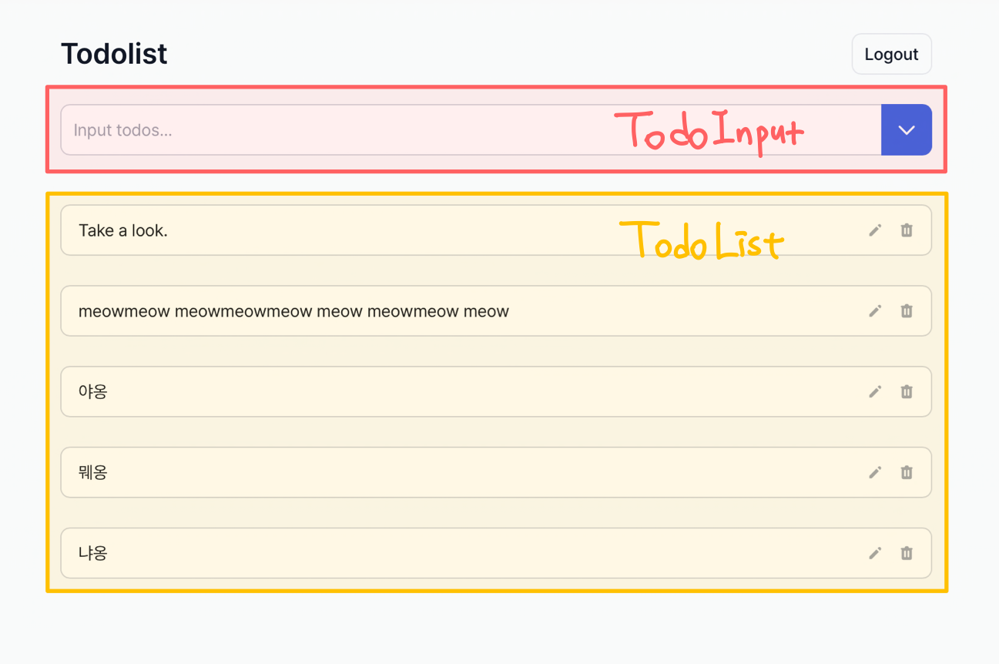
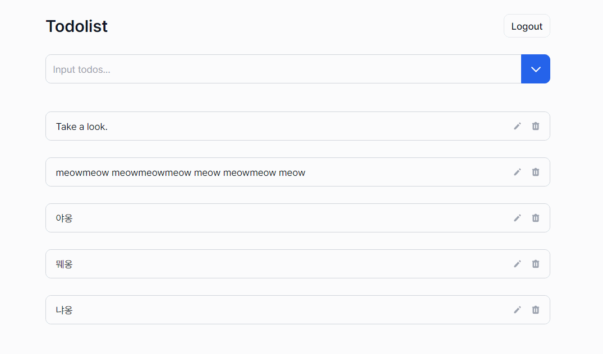

무한 렌더링하는 컴포넌트를 정말 필요한 때에만 리렌더링하도록 최적화해봤습니다.

1. 무한 렌더링을 탈출한 후,
2. `useCallback`과 `React.memo`를 이용해 리렌더링을 최적화합니다.

## 무한 렌더링 탈출하기

프로젝트는 간단한 투두리스트 앱으로 이렇게 생겼습니다.



백엔드 서버에 API 요청을 해서 투두리스트 관련 데이터를 다루고 있습니다.

TodoList 컴포넌트에서 투두 리스트 데이터를 받아와 화면에 보여줘야 하는데 그러면 API 요청이 필수적입니다.  
투두 리스트를 가장 최신 상태로 유지하는 것이 가장 좋지만 그러면 API 요청이 잦아지고 컴포넌트의 리렌더링도 잦아질수 있어 성능이 크게 떨어집니다.  
따라서 API 요청 자체를 최적화해야 합니다.

최적화 전의 TodoList 컴포넌트는 이런 식으로 데이터를 받아오고 있습니다.

```tsx
export default function TodoList() {
  const [todoList, setTodoList] = useState<Todo[]>([]);

  useEffect(() => {
    async function fetchTodoList() {
      setTodoList(await getTodos());
    }
    fetchTodoList();
  });

  // 후략
}
```

네, 맞습니다. 무한으로 데이터를 받아오는 최악의 상태입니다.  
`useEffect` 함수 안에서 `setTodoList` 함수를 통해 상태를 변화시키므로 TodoList 컴포넌트는 다시 렌더링되고 그러면 `useEffect` 함수가 또 다시 실행되어 무한으로 즐기게 됩니다.

이 무한 렌더링 상태에서 벗어나기 위해 두 가지 방법을 생각했습니다.

1. 투두리스트 데이터를 받아올 타이밍을 다루는 상태를 만들어서 관리하기  
   투두리스트 리렌더링 관련 상태를 만들어서 사용자가 투두를 생성했을 때, 수정했을 때, 삭제했을 때 등 특정 이벤트가 발생했을 때만 투두 리스트 데이터를 요청해서 리렌더링합니다.

2. 투두리스트 데이터를 상태로 관리하며 API 요청을 줄이기  
   투두리스트가 처음 렌더링되었을 때 최초 한번만 데이터를 fetch하여 받아옵니다. 해당 데이터를 state로 관리하며 사용자가 투두를 생성했을 때, 수정했을 때, 삭제했을 때 등 특정 이벤트가 발생했을 때 서버에 투두 리스트 데이터를 요청하여 데이터를 받아오는 대신 관리하던 투두리스트 상태를 기반으로 리렌더링합니다.

두 방법 모두 특정 이벤트에만 컴포넌트가 리렌더링되는 것은 같습니다만, 2번 방법이 투두 리스트 데이터를 받아오기 위한 API 요청이 줄어든다는 장점이 있습니다.  
하지만 동시에 데이터 일관성을 보장할 수 없다는 것을 의미합니다.  
투두리스트 앱 특성상 여러명이 사용할 일은 없지만 데이터 일관성을 유지하는 것이 추후 개발에 혼란을 야기하지 않을 것 같아 1번 방법을 선택했습니다.

TodoList를 리렌더링하는 타이밍을 알려줄 상태를 하나 만들고, 그 상태를 변화시킬 수 있는 함수를 TodoInput 컴포넌트와 Todo 컴포넌트에 전달합니다.  
투두리스트 리렌더링을 관리하는 컴포넌트를 새로 하나 만들고 TodoRerender라고 이름지었습니다.

```tsx
export default function TodoRerender() {
  const [rerenderFlag, setRerenderFlag] = seState(false);
  const rerender = () => {
    setRerenderFlag(!rerenderFlag);
  };

  return (
    <>
      <TodoInput rerender={rerender} />
      <TodoList rerenderFlag={rerenderFlag} rerender={rerender} />
    </>
  );
}
```

그러면 TodoInput 컴포넌트를 통해 투두를 생성할 때, Todo 컴포넌트를 통해 투두를 수정할 때와 삭제할 때 상태를 변화시켜 TodoList 리렌더링을 통제할 수 있습니다.

```tsx
export default function TodoList({
	rerenderFlag,
	rerender,
}: TodoListComponent) {
	const [todoList, setTodoList] = useState<Todo[]>([]);

	useEffect(() => {
		async function fetchTodoList() {
			setTodoList(await getTodos());
		}
		fetchTodoList();
	}, [rerenderFlag]);

	return (
		<div className="w-full mt-10 space-y-6">
			{todoList
				.slice(0)
				.reverse()
				.map(todo => (
					<Todo
						key={todo.id}
						todo={todo}
						rerenderTodoList={rerender}
					/>
				))}
		<div>
		);
};
```

이렇게 수정한 투두리스트 앱을 테스트해보면 무한 렌더링은 벗어났지만 문제가 하나 있습니다.  
TodoList 컴포넌트를 리렌더링할 때마다 상관없는 TodoInput 컴포넌트까지 같이 리렌더링됩니다.

## useCallback과 React.memo를 이용해 리렌더링 최적화하기



이런 불필요한 리렌더링이 발생하는 이유는 다음과 같습니다.

기본적으로 컴포넌트는 state가 변했을 때 리렌더링됩니다.  
그리고 상위 컴포넌트가 리렌더링된다면 그에 따라 하위 컴포넌트도 리렌더링됩니다.

따라서, TodoList 컴포넌트에서 TodoRerender의 상태를 변경시켰으므로 하위 컴포넌트인 TodoInput 컴포넌트와 TodoList 컴포넌트 모두 리렌더링되는 것입니다.

실제로는 TodoInput 컴포넌트가 변하지 않는데 불필요하게 리렌더링되는 것이므로 이러한 리렌더링을 방지할 것입니다.

1. TodoInput 컴포넌트의 props가 변하지 않았다면 TodoInput 컴포넌트를 리렌더링하지 않도록 방지하기
2. TodoRerender 컴포넌트에서 TodoInput 컴포넌트로 넘겨주는 rerender 함수가 다른 값으로 인식되지 않도록 만들기

1번 방법을 위해서는 `React.memo`를, 2번 방법을 위해서는 `useCallback`을 사용할 것입니다.

> 💡 **React.memo**  
>  컴포넌트의 props가 변하지 않았다면 해당 컴포넌트의 리렌더링을 방지하는 Built-in React API

> 💡 **useCallback**  
> 함수를 재사용할 수 있는 React hook  
> 이 hook을 사용하면 컴포넌트가 리렌더링되더라도 해당 함수의 내용이 변하지 않았다면 함수를 새로 만들지 않는다.  
> (원래는 컴포넌트가 리렌더링되면 그 컴포넌트 안의 함수도 전부 새로 만들어진다.)  
> 하지만 함수 내용이 실제로 변했을 때는 함수가 새로 만들어져야 하기 때문에 `[]`로 dependencies를 명시해서 해당 디펜던시 배열 안의 값 중 변한 게 있다면 함수가 새로 만들어지도록 해줘야 한다.

먼저 TodoInput 컴포넌트를 `React.memo` 함수로 감싸 props인 rerender 함수가 변하지 않았다면 리렌더링되지 않도록 만듭니다.

```tsx
function TodoInput({ rerender }: TodoInputComponent) {
  // 중략
}

export default React.memo(TodoInput);
```

그리고 TodoRerender 컴포넌트의 render 함수가 재사용될 수 있도록 useCallback 함수를 이용합니다.  
추가적으로 상태를 업데이트할 때 상태를 직접 이용하지 않고 이전 상태를 이용하도록 구현하여 디펜던시를 줄였습니다.

```tsx
export default function TodoRerender() {
  const [rerenderFlag, setRerenderFlag] = useState(false);
  const rerender = useCallback(() => {
    setRerenderFlag((prevRerenderFlag) => !prevRerenderFlag);
  }, []);

  // 후략
}
```

이렇게 하면 투두리스트 데이터를 렌더링할 때 TodoList 컴포넌트만 리렌더링되고 TodoInput 컴포넌트는 그대로 둘 수 있습니다.

> ⚠️ **React DevTools를 이용할 때의 주의점**  
> React DevTools를 통해 컴포넌트 렌더링을 측정할 때 위에 서술된 방법으로 최적화를 진행해도 TodoInput 컴포넌트가 리렌더링되는 것처럼 보여줍니다.
> 하지만 직접 console을 찍어보면 TodoInput 컴포넌트가 렌더링 최적화된 것을 알 수 있습니다.
> 왜 이렇게 동작하는 지는 알 수 없지만 도구에만 의존하지 않고 의문이 되는 부분은 따로 체크하는 습관을 들이는 것이 좋을 것 같습니다.

```toc

```
