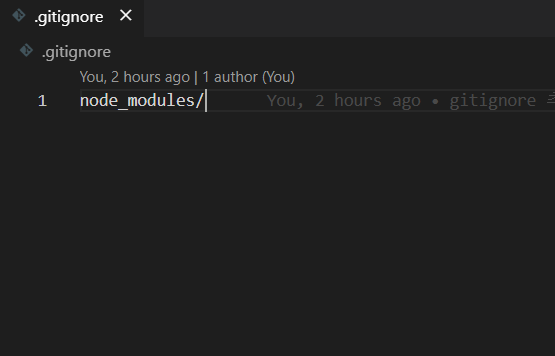

github에 프로젝트를 올릴 때 node_modules를 제외하고 올리는 방법입니다.

## `.gitignore` 파일 만들기

`.gitignore` 파일은 Push할 때 무시할 파일 혹은 디렉토리를 적어놓은 파일입니다.  
`.gitignore` 파일에 작성된 파일 혹은 디렉토리는 원격저장소에 저장되지 않습니다.  
이 `.gitignore` 파일을 활용해서 `node_modules` 디렉토리는 물론 다른 파일들도 원격저장소에 저장되지 않도록 할 수 있습니다.



이런 식으로 작성하면 `node_modules` 디렉토리는 추적당하지 않습니다.

만약 이미 `node_modules`를 push했다면 어떻게 해야 할까요?

## 원격저장소의 node_modules 제거하기

이미 `node_modules`를 push하여 github에 모듈과 관련된 많은 파일들이 올라갔다면?

지금이라도 `.gitignore`를 작성해주고, 저장소에서 `node_modules` 디렉토리를 삭제해야 합니다.  
`package.json` 파일과 `package-lock.json` 파일이 있다면 `npm init` 명령어를 통해 언제든지 `node_modules` 디렉토리를 생성할 수 있으니 삭제할 때 걱정하지 않아도 됩니다.

### 원격저장소,로컬저장소에서 삭제하기

```bash
git rm 파일명
git rm -r 폴더명
```

### 원격저장소에서만 삭제하기

```bash
git rm --cached 파일명
git rm --cached -r 폴더명
```

- `--cached`: 원격저장소만 해당
- `-r`: recursive(재귀적으로), 디렉토리와 하위 내용 삭제

### 원격저장소의 node_modules 삭제하기

```bash
git rm --cached -r node_modules
```

```toc

```
