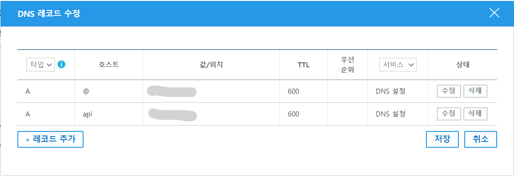

프론트엔드 개발을 위해 백엔드 REST API 서버를 만들었는데 다음과 같은 에러가 발생했다.

> ❌ **Mixed Content**: The page at 'https://ordinary-todolist.netlify.app/login' was loaded over HTTPS, but requested an insecure XMLHttpRequest endpoint 'http://43.201.130.34:8000/auth/signin'. This request has been blocked; the content must be served over HTTPS.

내용을 해석해보니 요청을 HTTPS로 보내라는 것이다.  
하지만 내 REST API 서버는 HTTPS 통신 설정도 안한 작고 소중한 아이였다..  
어쩔수 없지. 까짓거 한다.

## 도메인 구매

HTTPS 통신을 설정하기 위해서는 SSL 인증서가 필요하고, SSL 인증을 받기 위해서는 도메인이 필요하다.  
도메인을 구매할 수 있는 경로는 다양하다.  
나는 가비아를 통해서 구매했고 레코드 설정도 해줬다.



도메인을 구매한 후 등록할 때 시간이 조금 걸리므로 여유를 가지고 확인하는 게 좋다.

## SSL 인증

SSL 인증서를 발급해주는 곳은 다양한데 무료로 유명한 곳인 Let’s Encrypt를 이용했다.  
Let’s Encrypt는 인증서를 발급해주는 곳이고 내 서버에서 이 인증서를 발급받기 위해서 certbot이라는 패키지를 이용했다.  
발급받기 위한 다른 방법들도 있지만 certbot이 가장 대중적인 방법인 듯 하다. Let’s Encrypt 공식 홈페이지에서도 certbot을 사용하길 권장하고 있다.

먼저, certbot을 설치한다.

```bash
sudo apt-get install certbot
```

그리고 인증서를 발급받기 전에 nginx를 설치해준다.

```bash
sudo apt-get install nginx
```

드디어 인증서 발급

```bash
sudo certbot certonly --nginx
```

위 명령어를 치면 이메일을 입력하라거나 동의하라거나 도메인 주소를 입력하라거나 여러가지를 시키는데 알아서 잘 입력해주면 된다.  
그러면 인증서는 `/etc/letsencrypt/live/도메인주소/fullchain.pem`에, 키는 `/etc/letsencrypt/live/도메인주소/privkey.pem`에 저장된다.

이제 이 인증서와 키를 nginx에게 알려줘야 한다.

## NginX 설정

아래 명령어를 통해 nginx 설정 파일을 편집한다.

```bash
sudo vi /etc/nginx/sites-available/default
```

설정 파일을 편집하기에 앞서 나의 목표는 다음과 같다.  
클라이언트에서 해당 인스턴스로 HTTPS로 요청하면 nginx의 reverse proxy 기능을 이용해 8000번 포트에서 돌아가고 있는 API 서버로 요청을 보내주는 것이다.

아래와 같이 써줬다.  
편집하고 나서 `:q!`는 저장안하고 강제로 나가기, `:wq`는 저장 후 나가기. 잊지 말자.

```bash
server {
		listen 80;
		server_name default_server;
		return 301 https://$host$request_uri;
}

server {
		listen 443 ssl;
		server_name default_server;

		ssl_certificate /etc/letsencrypt/live/도메인주소/fullchain.pem;
		ssl_certificate_key /etc/letsencrypt/live/도메인주소/privkey.pem;

		location / {
				proxy_pass http://localhost:8000;
				proxy_http_version 1.1;
				proxy_set_header Host $host;
				proxy_set_header X-Real-IP $remote_addr;
		}
}
```

HTTP 통신으로 요청오면 자동으로 HTTPS 통신으로 넘어가도록 했다. (그냥. 어차피 HTTPS로 해야 에러 안나니까)  
HTTPS 통신으로 요청이 오면 SSL 인증할 수 있도록 인증서랑 키의 위치를 입력해주고 8000번 포트로 연결해줬다.  
`proxy_pass` 아래는 그냥 프록시 관련 설정들이다.

nginx 설정을 해줬으면 nginx를 시작해주거나, 이미 켜져있다면 재시작해준다.

```bash
sudo service nginx restart
```

재시작 명령어만 써놓은 이유는 시작했는지 고민할 시간에 수시로 재시작하는 게 더 편해서 ㅎㅎ

시작하기 전에 nginx 테스트를 해봐도 좋다.  
설정 파일에 문제가 없는지 테스트해준다.

```bash
sudo nginx -t
```

nginx를 시작하고 나서 제대로 돌아가는지 확인할 수도 있다.

```bash
sudo systemctl status nginx
```

구매했던 도메인 주소로 잘 들어가지면 성공!

사실 nginx 설정은 이전에도 몇 번 해봤었는데 어떤 용도로 사용하느냐에 따라 설정을 달리 해주다 보니 할때마다 헤맨다..  
그래도 점점 알아가는 것 같아서 좋다.

```toc

```
