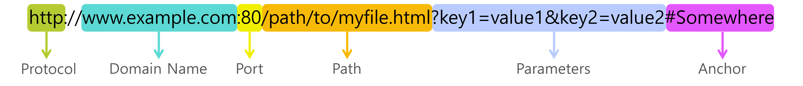

내 웹사이트에서 Github Issue 기능으로 업로드한 사진에 접근하도록 개발하고 있었는데 `XMLHttpRequest` 에러와 부딪히면서 CORS와 SOP에 대해 알아보게 되었다.  
여러가지 이유로 사진을 Github Issue가 아닌 별개의 Github Repository에 업로드하게 되면서 `XMLHttpRequest` 에러는 해결됐지만 정말 중요한 내용이라 잊지 않도록 간략하게 정리한다.

## 동일 출처 정책(SOP)이란?

Same-Origin Policy  
출처가 서로 다르다면 리소스 상호작용을 제한하는 보안 방식

아무 스크립트나 리소스와 상호작용할 수 있도록 두면 보안이 매우 취약해지기 때문에 출처가 같아야 상호작용할 수 있도록 제한한다.

여기서 **출처**라는 게 뭔지 알아보자.

### 출처란?

두 URL의 프로토콜, 도메인 이름, 포트(명시한 경우) 가 모두 같아야 동일한 출처다.



`http://store.company.com`과 동일한 출처는 다음과 같다.

- `http://store.company.com/dir2/other.html`
- `http://store.company.com/dir/inner/another.html`

위 두 URL은 path만 다를 뿐 출처는 동일하다.

아래 URL들과 같이 protocol, domain name, port 중 하나라도 다르다면 동일한 출처가 아니다.

- `https://store.company.com/secure.html`
- `http://store.company.com:81/dir/etc.html`
- `http://news.company.com/dir/other.html`

## 교차 출처 리소스 공유(CORS)란?

Cross-Origin Resource Sharing  
한 출처에서 실행중인 웹 애플리케이션이 다른 출처의 자원에 접근하려면 HTTP 헤더에 권한을 부여해야 하는 것

여기서 교차 출처는 다른 출처라고 생각하면 편하다.

SOP 때문에 같은 출처에서만 리소스를 공유할 수 있는데 개발하다보면 다른 출처끼리도 리소스를 공유할 일이 생긴다.  
이럴때 HTTP 헤더에 권한을 부여해줘 다른 출처끼리도 리소스를 공유할 수 있도록 해주는 것이 CORS이다.

HTTP 헤더에 접근 권한도 없으면서 출처가 다른 자원에 접근하면 CORS 정책 위반으로 인한 에러가 발생한다.  
때문에 다음과같이 HTTP 헤더에 접근 권한을 부여해줘야 한다.

### HTTP 헤더에 접근 권한 부여하기

서버에서 요청에 대한 응답을 보낼 때 `Access-Control-Allow-origin` 헤더에 요청 헤더의 `Origin`을 포함하면 된다.  
만약 `Access-Control-Allow-Origin: *`으로 설정할 경우, 모든 도메인에서 접근할 수 있어 편리하지만 보안이 취약해지므로 주의하자.

---

참고

- [MDN 동일 출처 정책](https://developer.mozilla.org/ko/docs/Web/Security/Same-origin_policy)
- [MDN URL](https://xn--developer-9700b.mozilla.org/ko/docs/Learn/Common_questions/Web_mechanics/What_is_a_URL)
- [MDN 교차 출처 리소스 공유](https://developer.mozilla.org/ko/docs/Web/HTTP/CORS)

```toc

```
