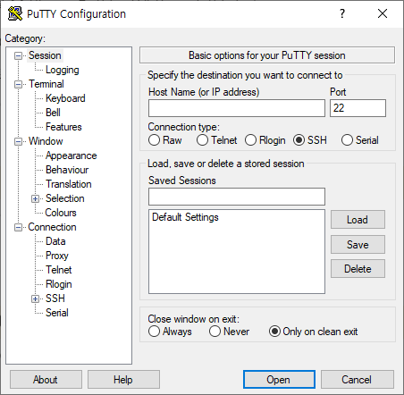
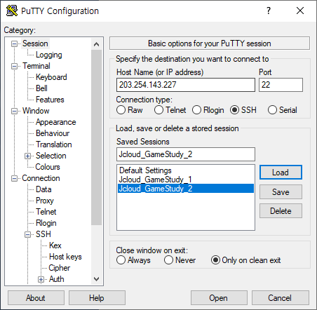
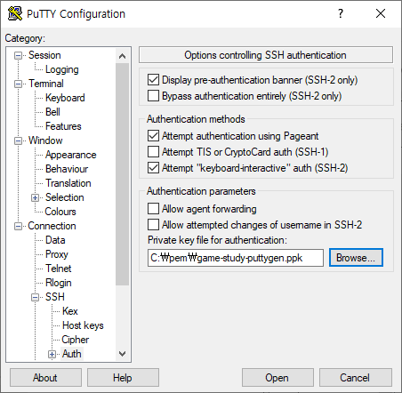
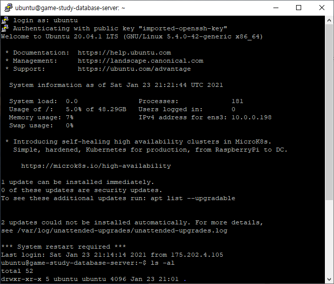
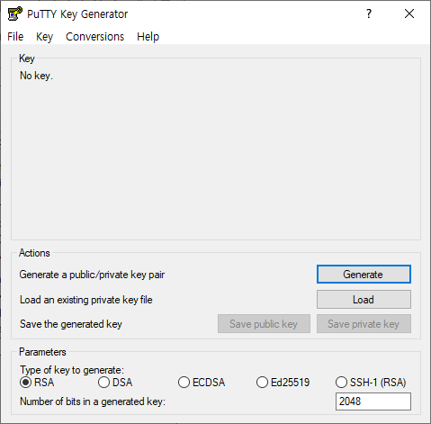
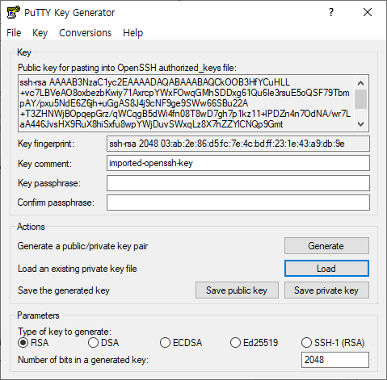
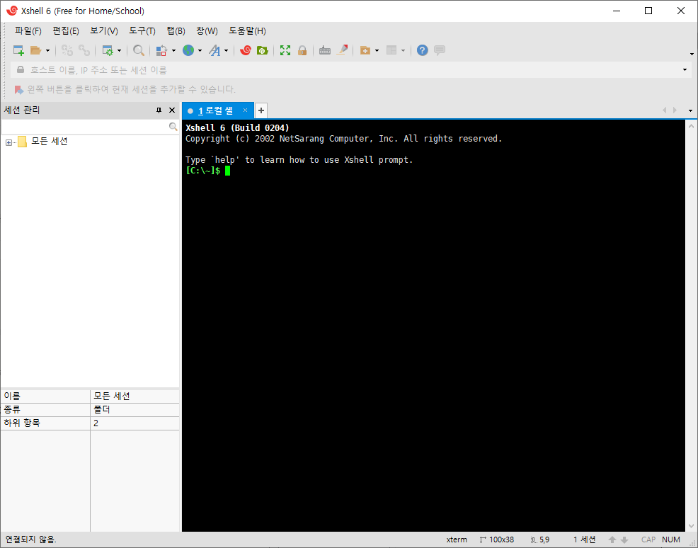
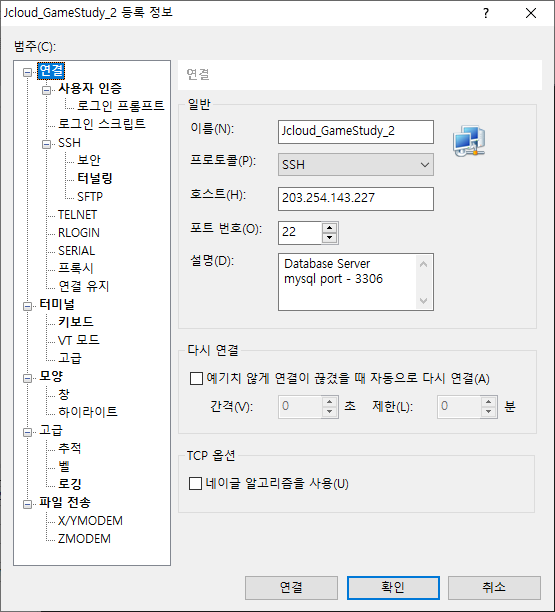
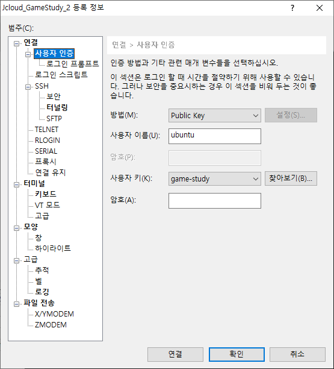
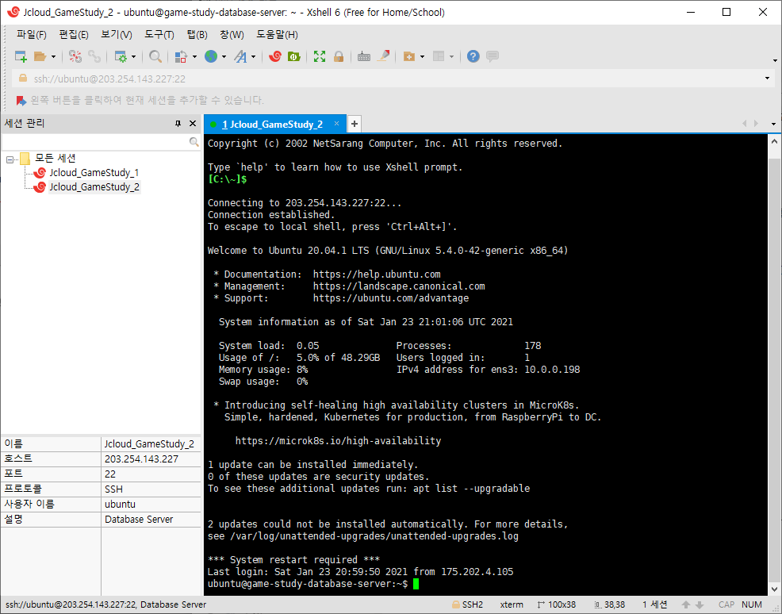

SSH 클라이언트인 PuTTY와 Xshell을 이용해서 SSH 접속하는 방법을 정리했습니다.

## SSH(Secure SHell protocol)이란?

네트워크 프로토콜 중 하나로, 네트워크 상의 다른 컴퓨터에 로그인하거나 원격 시스템에서 명령 실행하고 다른 시스템으로 파일을 복사할 수 있는 응용 프로그램 또는 그 프로토콜을 의미합니다.

SSH 클라이언트를 이용해서 SSH 접속할 수 있습니다.  
SSH 클라이언트는 SSH 프로토콜을 이용해 원격 서버에서 접속하는 프로그램입니다.  
SSH 클라이언트로는 PuTTY, Xshell, MobaXTerm, OpenSSH Client 등등 이 있습니다.  
가장 자주 사용되는 건 PuTTY이며 해당 게시글에서는 그 중 PuTTY와 Xshell 두개를 사용했습니다.

## PuTTY로 SSH 접속하기

`PuTTY Release 0.74`를 사용했습니다.



### 1. [Session] 에서 Host Name과 Port를 입력하기

`Saved Sessions`에 원하는 이름을 넣고 `Save` 버튼을 누르면 저장되므로 세팅을 다시 할 수고를 줄여줍니다.



### 2. [Connection] - [SSH] - [Auth] 에서 Private Key 입력하기



서버가 Public Key를 보내고 클라이언트에서 Private Key를 보내서 인증할 경우, 해당 경로에서 Private Key를 입력해줍니다.  
`Browse` 버튼을 통해 Key 파일을 찾습니다.

ppk 형식이 아니라면 사용할 수 없으므로 pem 파일은 ppk 파일로 바꿔줘야 합니다.  
변환 방법은 아래에 있습니다.

### 3. Open 버튼을 눌러 접속하기



**PuTTY Key Generator (PuTTYgen)을 사용하여 pem 파일을 ppk 파일로 변환하기**

1. `Load`를 눌러 변환하고 싶은 pem 파일을 선택합니다.



2. `Save private key`를 눌러 저장합니다.



3. 저장한 private key를 필요한 곳에 사용합니다.

## Xshell로 SSH 접속하기

`Xshell 6(Free for Home/School)`를 사용했습니다.



### 1. 새 세션 만들기

`연결`에서 기본적인 정보를 입력해줍니다.



### 2. [사용자 인증] 에서 key와 관련된 정보 입력하기

`사용자 키`의 `찾아보기` 버튼을 눌러 key 파일을 등록할 수 있습니다.  
PuTTY 와 달리 pem 파일도 가능합니다.  
PuTTYgen을 사용하지 않아도 된다는 점이 마음에 듭니다.



### 3. 접속하기



주변에 PuTTY를 쓰는 사람이 많은데 개인적으로 pem 파일도 가능하다는 점에서 Xshell이 더 편했습니다.

```toc

```
