OCI에서 ubuntu 인스턴스를 만들고 nginx를 이용해서 react 프로젝트를 호스팅했다.  
OCI에 무료 인스턴스가 남아있어 AWS가 아닌 OCI를 사용했는데 OCI와 AWS가 좀 달라서 헷갈렸다.

## 인스턴스 만들고 기본적인 설정하기

먼저 OCI에 ubuntu 인스턴스를 만든다.

### 1. VCN 생성하고 인스턴스에 연결하기

웹 호스팅이기 때문에 인스턴스를 만든 뒤 웹과 관련된 포트를 꼭 열어줘야 한다.  
http로 접속하는 것을 허용하려면 80을, https로 접속하는 것을 허용하려면 443을 열어야 한다.

그러기 위해서 OCI의 VCN(가상 클라우드 네트워크) 메뉴에서 VCN을 생성한다.  
아래와 같이 VCN 마법사를 통해 손쉽게 만들 수 있다.

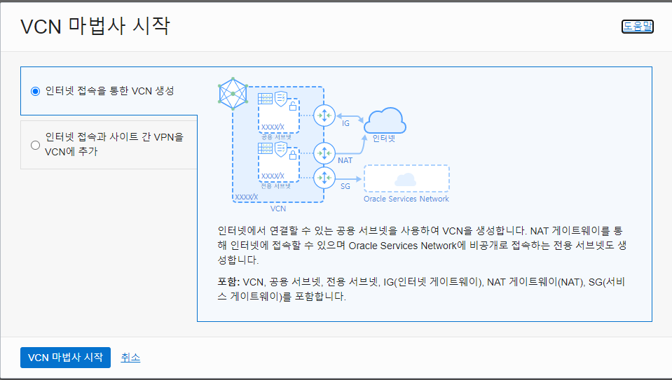

만들어진 VCN의 공용 서브넷에 들어가 수신 규칙을 추가한다.  
난 아래 체크된 것처럼 80, 443, 3000 세가지 포트를 추가해줬다.

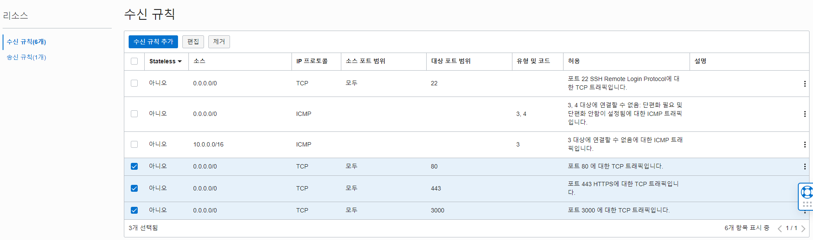

인스턴스에 만들어둔 VCN을 적용한다.

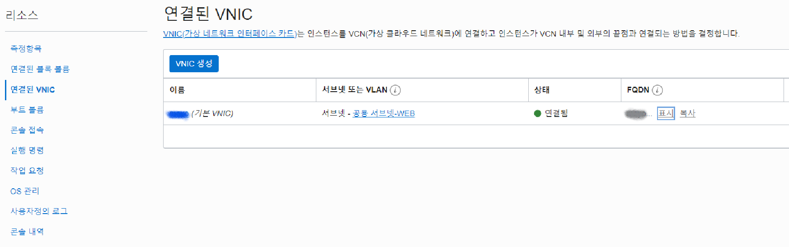

**🔥 VNIC가 생성되지 않을 때**  
이미 VNIC가 존재하는 인스턴스에서 VNIC를 생성할 경우 다음과 같은 에러가 발생하며 생성되지 않는다.

> The maximum number of VNICs for this instance based on its shape are already attached. Detach an existing VNIC before attaching a new one, or change the instance to a shape that supports more VNICs. Learn more at https://docs.cloud.oracle.com/iaas/Content/Network/Tasks/managingVNICs.htm

따라서 인스턴스를 만든 후 추가하기 보다 처음에 인스턴스를 만드는 과정에서 VNIC를 생성하길 권장한다.  
난 기존 인스턴스를 삭제한 뒤 다시 인스턴스를 만들었다 😂

### 2. 예약된 공용 IP 주소 사용하기

고정된 공용 IP 주소를 사용하지 않으면 서버를 재부팅할 때마다 공용 IP 주소가 바뀐다.  
매우 번거로워질 수 있으므로 가능하면 고정된 공용 IP 주소를 사용하는 것이 좋다.

free-tier 계정은 예약된 공용 IP를 한개까지 만들 수 있다.


해당 IP를 적용할 인스턴스의 연결된 VNIC에 들어간다.  
IPv4 주소를 편집하여 예약된 공용 IP 주소로 바꾼다.  
예약된 공용 IP가 바로 선택되지 않는 경우, 일단 공용 IP 없음으로 체크한 뒤 다시 편집으로 들어가 바꿔준다.

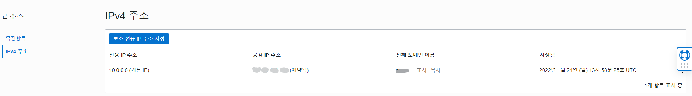

## ubuntu에 React 프로젝트 환경 만들기

이전에 작성했던 [ubuntu nodejs 프로젝트 환경 만들기](https://heony704.github.io/ubuntu-nodejs-setting) 포스트를 참고했다.

동일하게 nodejs를 설치한 뒤, git으로 프로젝트를 복제했다.  
프로젝트에 yarn을 사용했기 때문에 추가로 설치했다.

React 프로젝트를 배포하기 위해 yarn build 명령어로 빌드 폴더를 생성한다.  
이제 빌드된 폴더 위치를 nginx가 알 수 있어야 한다.

## nginx로 웹 호스팅하기

> nginx란?  
> 웹 서버, 리버스 프록시, 메일 프록시 기능을 가진 웹 서버 소프트웨어

nginx를 통해 client로부터 서버로 요청이 들어왔을 때 적절한 응답을 할 수 있다.

### 1. nginx 설치

```bash
sudo apt install nginx
```

nginx 디렉토리의 내부는 다음과 같이 구성되어 있다.

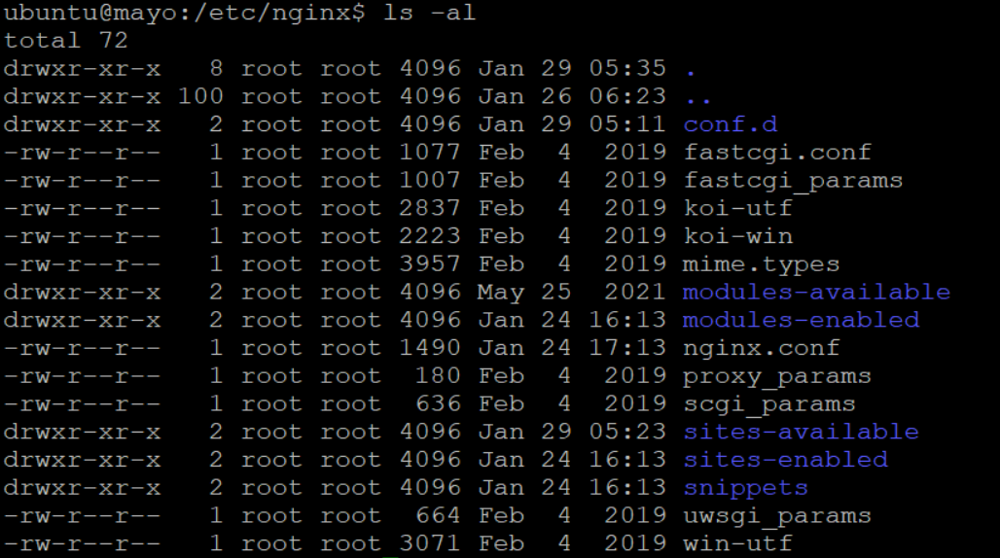

`nginx.conf` 파일은 nginx의 기본적인 설정이 기록되어 있다.

### 2. build 폴더 연결하기

다음과 같이 `nginx.conf` 파일의 http 블럭에 server 블럭을 추가하거나 수정해서 호스팅할 웹에 대해 설정할 수 있다.

```conf
http {
  // 생략
  server {
    listen 80;
    server_name _;
    root html;
    // 생략
  }
}
```

위와 다르게 다른 파일에 server 관련 설정을 저장한 뒤, `nginx.conf` 파일에서 불러오는 방법도 있다.

`nginx.conf` 파일의 http 블럭을 살펴보면 아래 사진과 같이 `sites-enabled` 폴더의 모든 파일을 include하는 것을 볼 수 있다. (버전에 따라 다를 수 있다.)

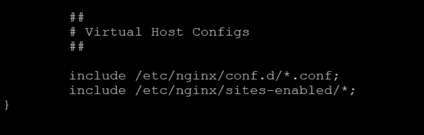

`sites-enabled` 폴더는 `sites-available` 폴더에 있는 파일들을 symlink로 연결한 폴더다.  
`sites-available` 폴더의 `default` 파일에서 서버 블록을 설정하면 nginx에 해당 설정이 반영된다.

```bash
sudo vi /etc/hginx/sites-available/default
```

`sites-available` 폴더의 `default` 파일을 연 뒤, root 뒷부분을 react 프로젝트 빌드 파일 주소로 수정한다.

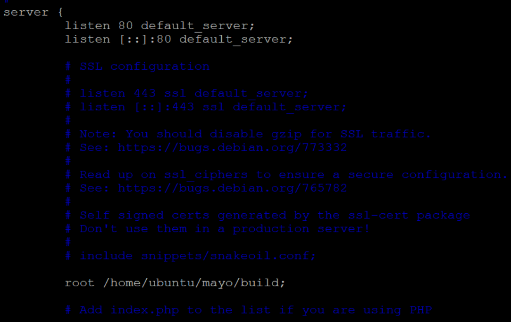

`esc`를 누른 뒤 `:wq`를 입력해 빠져나오는 것을 잊지 말자.

### 3. nginx 실행하기

**- 테스트하기**

```bash
sudo nginx -t
```

아래와 같이 나오면 테스트 성공이다.

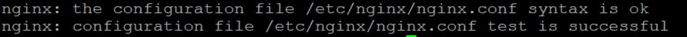

**- 시작하기**

```bash
sudo systemctl start nginx
```

**- 상태 확인하기**

```bash
sudo systemctl status nginx
```

정상적으로 실행중이라면 아래와 같이 나온다.

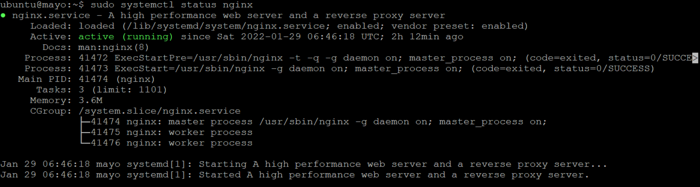

**- 멈추기**

```bash
sudo systemctl stop nginx
```

**🔥 포트가 이미 사용중이라서 nginx가 실행되지 않을 때**  
port가 이미 사용중이기 때문에 nginx가 실행되지 않는 오류가 발생한다면, 먼저 해당 port를 확인해 봐야 한다.  
`netstat`을 통해 해당 포트가 열려있는지 확인할 수 있다.

아래 명령어를 통해 열려있는 포트를 확인할 수도 있고,

```bash
sudo netstat -ntap | grep "LISTEN "
```

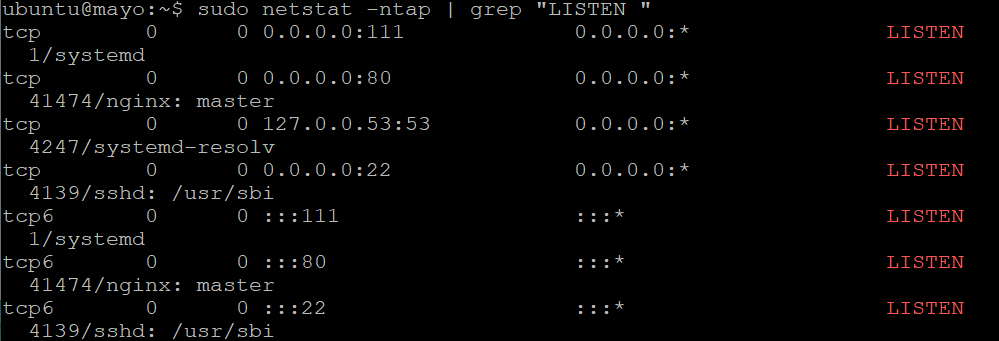

아래 명령어를 통해 특정 포트만 따로 확인할 수도 있다.

```bash
sudo netstat -ntap | grep 80
```

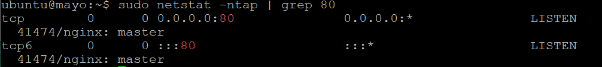

nginx가 포트를 사용할 수 있도록 해당 포트에 할당된 프로세스를 죽이면 된다.

```bash
sudo kill -9 프로세스ID
```

내가 겪은 문제는 nginx가 사용할 포트를 nginx가 이미 사용중이기 때문에 에러가 발생한 이해할 수 없는 문제였다. 🤔  
알아보니까 `service nginx restart` 명령어랑 `systemctl` 명령어를 섞어서 사용하다보니 발생한 문제같다.  
확실한 원인은 파악하지 못했지만 포트를 차지한 nginx를 계속 kill하고 `systemctl` 명령어로만 사용하니 같은 문제가 발생하지 않았다.

**🔥 혹시 방화벽 문제인가 싶을 때**  
nginx를 실행했지만 웹이 열어지지 않는다면, ubuntu 방화벽에서 외부 접근을 막아서 발생한 에러인지 확인해 봐야 한다.

아래 명령어를 통해 방화벽을 아예 해제할 수 있다. 방화벽을 해제했는데도 에러가 발생한다면, 방화벽 문제가 아닌 것이다.

```bash
sudo ufw disable
```

아래는 ubntu 방화벽에서 80포트의 외부 접근을 허가하는 명령어다.

```bash
sudo iptables -I INPUT 1 -p tcp --dport 80 -j ACCEPT
```

참고로 INPUT 키워드는 외부에서 내부로 접속하는 것을 허가하며, OUTPUT 키워드를 사용하면 내부에서 외부로 나가는 것을 허가한다.

## 웹 접속하기

다른 네트워크에 속한 PC에서도 `http://[공용IP주소]`를 입력하면 내가 호스팅한 웹에 접속할 수 있다! 🥳  
만약 https 관련 설정도 했다면 `https://[공용IP주소]`로도 접속 가능하다.

```toc

```
